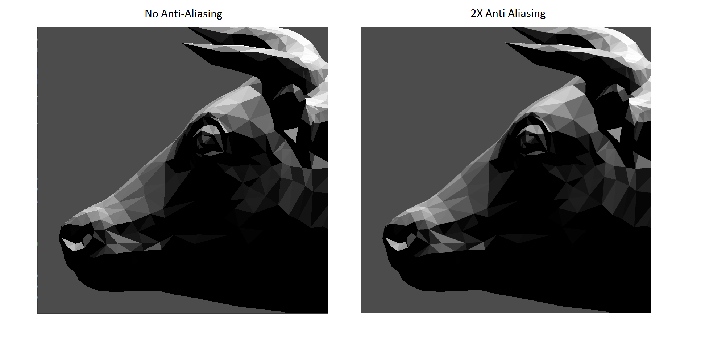

CUDA Rasterizer
===============

**University of Pennsylvania, CIS 565: GPU Programming and Architecture, Project 4**

* Ratchpak (Dome) Pongmongkol
* Tested on: Windows 10, i7 @ 2.4GHz 16GB, GT 650M 1024MB (rMBP Early 2013)

## Features

- Vertex shader
- Primitive assembly
- Backface culling (with thrust::remove_if)
- Rasterization
    - Scissor Test
    - Depth testing (with atomics for race avoidance)
    - Fragment Shading (basic Lambert Diffuse-only lighting)
    - Color interpolation with barycentric coordinates
- Mouse-based interactive camera support
    - Spherical Camera : [W] and [S] to zoom in-out. Use mouse to rotate around the target position (0,0,0)
- Anti Aliasing

##Performance Analysis
### Sample Image

### Breakdown

Note that there are not much performance difference from backface culling. This is because I already check if the triangle's AABB.min.Z and AABB.max.Z value is in the range [0, -1] before rasterizing.
