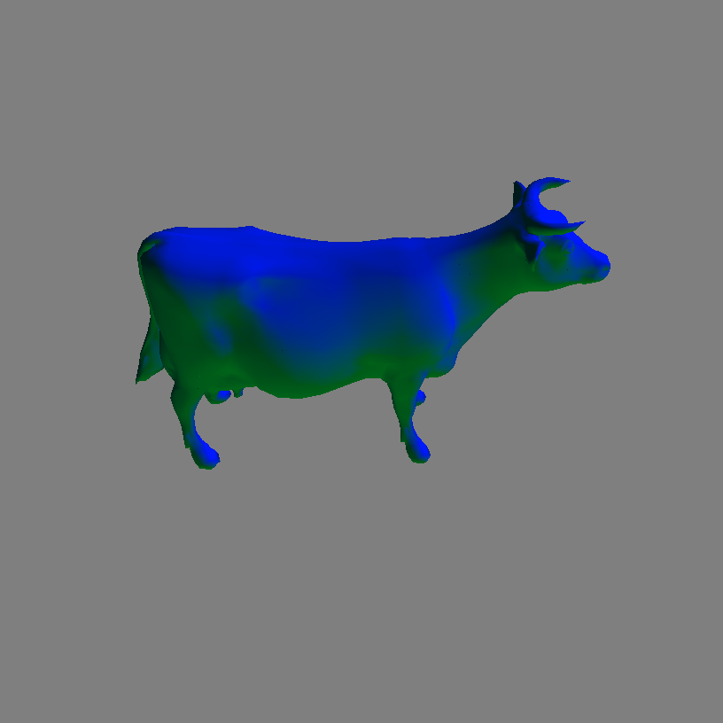
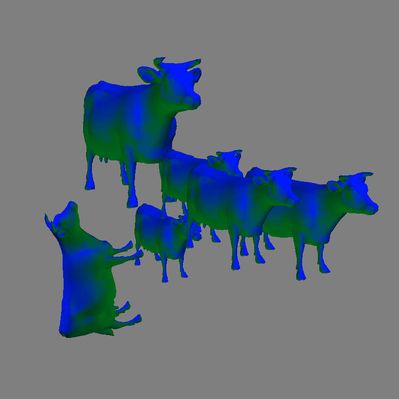
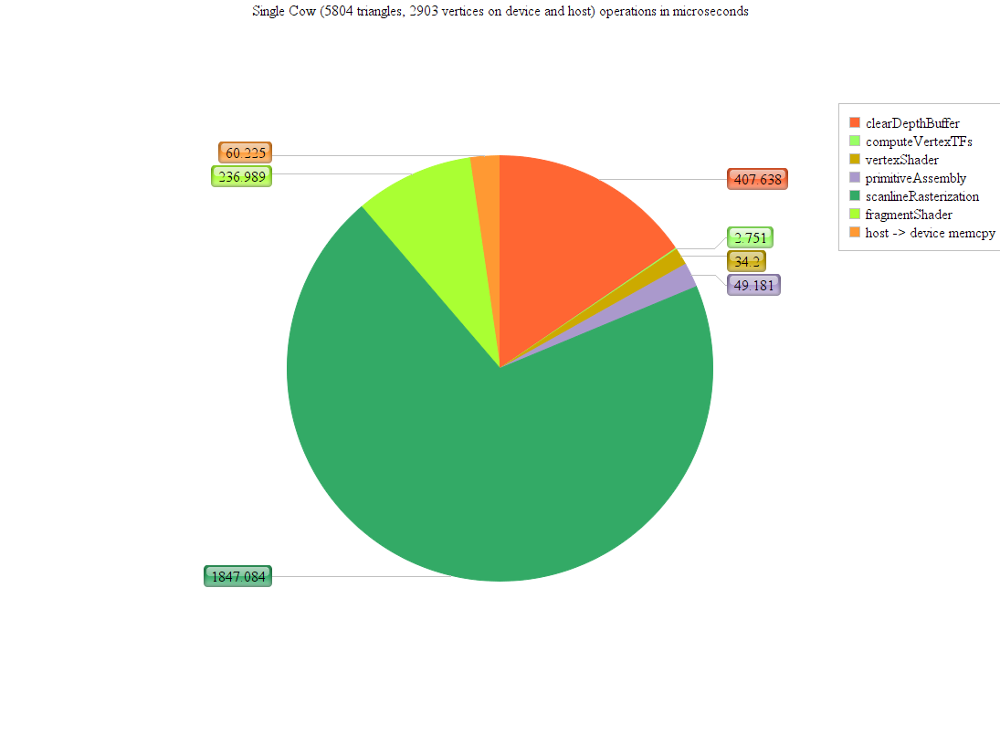
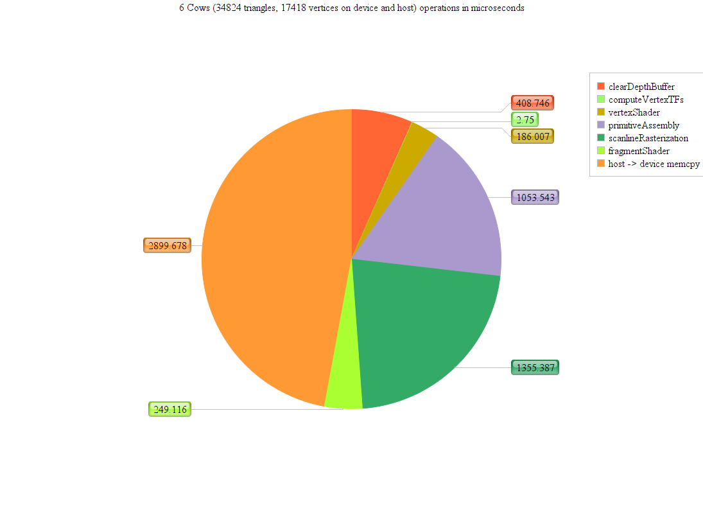
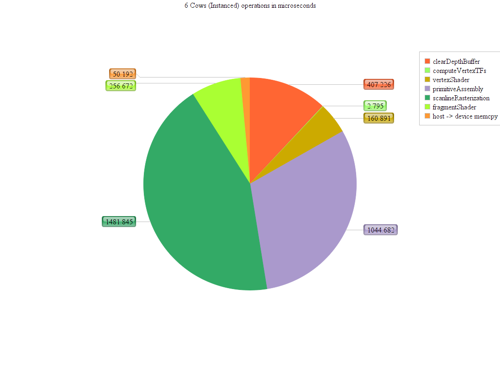
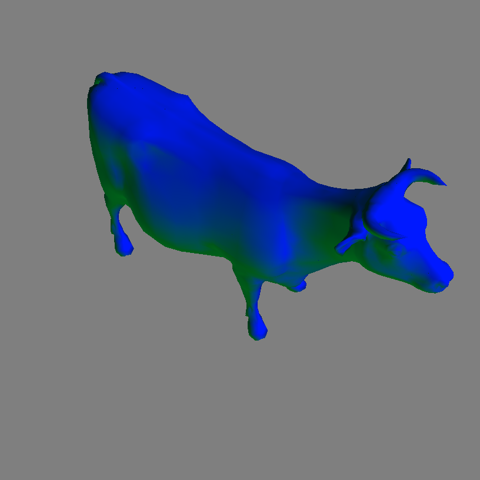

CUDA Rasterizer
===============

**University of Pennsylvania, CIS 565: GPU Programming and Architecture, Project 4**

* Kangning (Gary) Li
* Tested on: Windows 10, i7-4790 @ 3.6GHz 16GB, GTX 970 4096MB (Personal)

This repository contains a basic rasterization pipeline written in CUDA. This pipeline has the following rough stages, as seen in the rasterize() function in [rasterize.cu](src/rasterize.cu#L856):
* clear the fragment/depth buffer
* multiply all scenegraph transformation matrices by the view/projection matrix
* shade vertices
* perform primitive assembly
* use scanline rasterization to generate fragments. perform depth tests.
* shade the fragments
* copy the fragments to the frame buffer

This pipeline also supports instancing, anti-aliasing, and tile based rasterization. Enabling anti-aliasing and tile rasterization cause some notable changes to the pipeline, which will be explained below.

**Places to Tweak**
Most configurable settings are in [main.cpp](src/main.cpp), which handles sending delivering buffers of vertices, normals, indices, and matrices to the rasterizer. The [top](src/main.cpp#L16) of the file contains some variables that can be used to control the camera's starting state. Camera controls are spherical. The camera can also be controlled using the keyboard. The left, right, up and down arrow keys rotate the "sphere" of the camera, while the z and x keys control the "radius." Field of view can also be changed with f and g but may be unpredictable.
[Line 199](src/main.cpp#L199), if uncommented, activates tiled rendering.
[Line 202](src/main.cpp#L202) similarly toggles anti aliasing.
Adding modeling transformations to the [transformations vector](src/main.cpp#L181) allows adding additional instances.
Changing [src/rasterize.cpp#L912] from MSAA to FSAA will switch between multisample and full screen antialiasing.

**Instancing**
 

Instancing allows "drawing" one model (one set of vertices, indices, and normals - this rasterizer only supports rendering one model at a time) multiple times in a scene with different transformations. This rasterizer implements instancing by keeping a larger buffer for primitives and transformed vertices. It also adds a pipeline stage in which model matrices (translation * rotation * scale) are multiplied by the camera's view/projection matrix.

The point of instancing isn't to increase performance on the GPU (the GPU is still drawing all the triangles) but to decrease the bandwidth consumption when preparing a scene by reducing the amount of data that needs to be sent from the host to the device. This improvement is demonstrated by the following charts:

  

In this comparison, 6 cows were rasterized by uploading an obj file with 6 cows in it (see [objs/many_cows.obj](many_cows.obj)) and separately by uploading data for a single cow and transformations for 6. Although the relevant pipeline section runtimes were about the same for both cases, the host-to-device transfer time differs dramatically.

**Anti Aliasing**

 

This rasterizer implements two forms of antialiasing: Full Screen Antialiasing (FSAA) and Multi Sample Antialiasing (MSAA). Full Screen Antialiasing is closest to the original concept of antialiasing: multisample each pixel to produce a smooth result. In this pipeline, enabling antialiasing replaces the standard scanline rasterization and depth test stage with one that takes 5 samples per fragment distributed across the fragment's screen coordinate area, which results in additional computation time. Where FSAA and MSAA differ is in fragment shading: FSAA shades each of the 5 samples independently, while MSAA only shades each sample that strikes a unique primitive. The result, as demonstrated below, is that the MSAA pipeline spends less time in fragment shading, which would produce more dramatic performance gains over FSAA with a highly complex fragment shader:

Although MSAA is an approximation of FSAA, the results are visibily similar. This is because aliasing is mostly noticed on the edgs of primitives, so MSAA "cheats" by treating samples from one fragment striking "inside" primitives similarly to single-sampled fragments. The FSAA image is on the right and the MSAA image is on the left.

  
