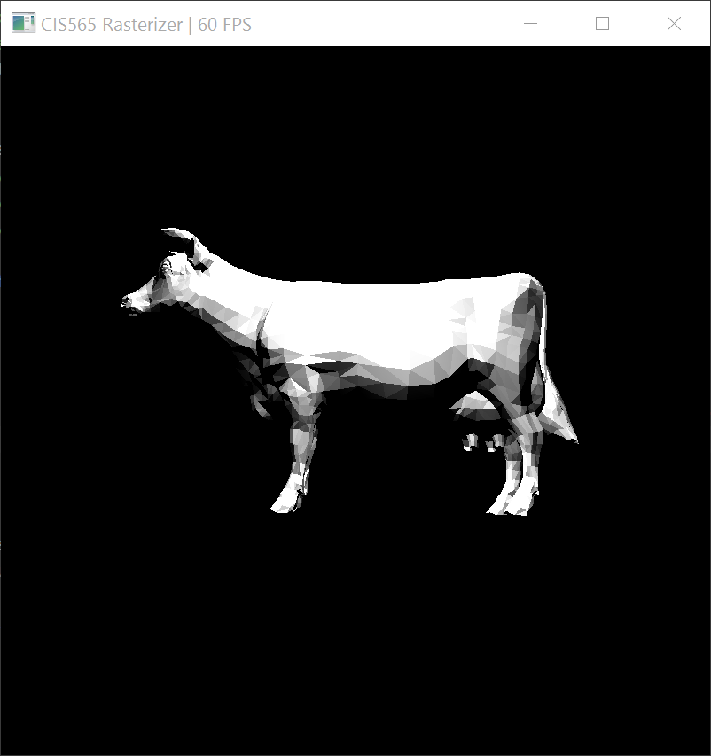

CUDA Rasterizer
===============

**University of Pennsylvania, CIS 565: GPU Programming and Architecture, Project 4**

* Ratchpak (Dome) Pongmongkol
* Tested on: Windows 10, i7 @ 2.4GHz 16GB, GT 650M 1024MB (rMBP Early 2013)

## Features

- Vertex shading.
- (Vertex shader) perspective transformation.
- Primitive assembly with support for triangles read from buffers of index and vertex data.
- Backface culling (with thrust::remove_if)
- Rasterization + depth testing (with atomics for race avoidance)
- Fragment shading 
- Basic Lambert Diffuse-only lighting.
- Color interpolation with barycentric coordinates
- Mouse-based interactive camera support
- Scissor Test

