CUDA Rasterizer
================

**University of Pennsylvania, CIS 565: GPU Programming and Architecture, Project 4**

* Shuai Shao (Shrek)
* Tested on: Windows 10, i7-4710HQ @ 2.50GHz 16GB, GeForce GTX 970M (Personal Computer)

-----------------------------------------

## Video Demo
* video demo: 
[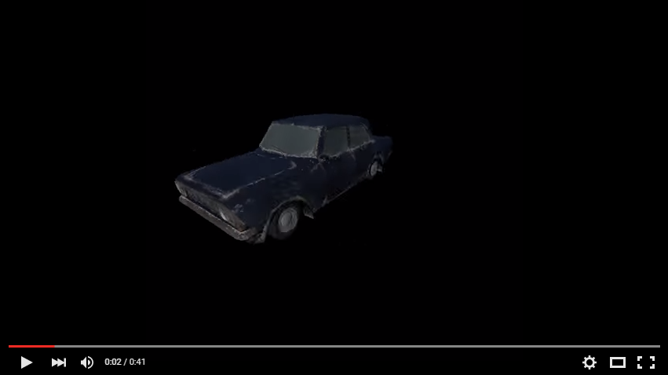](https://www.youtube.com/watch?v=w6E4QnAhRAY)

## Feature Display Images

#### earth ( bilinear texture filtering; diffuse, specular map)
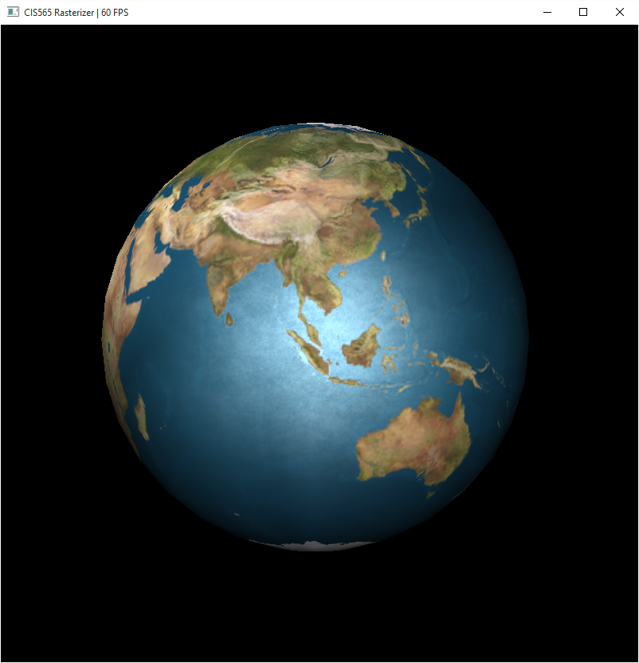

|nearest neighbor filtering | bilinear filtering |
|--------------------------| --------------------|
|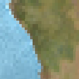 |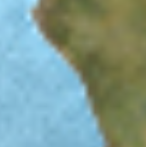 |

#### Rusty car( bilinear texture filtering)
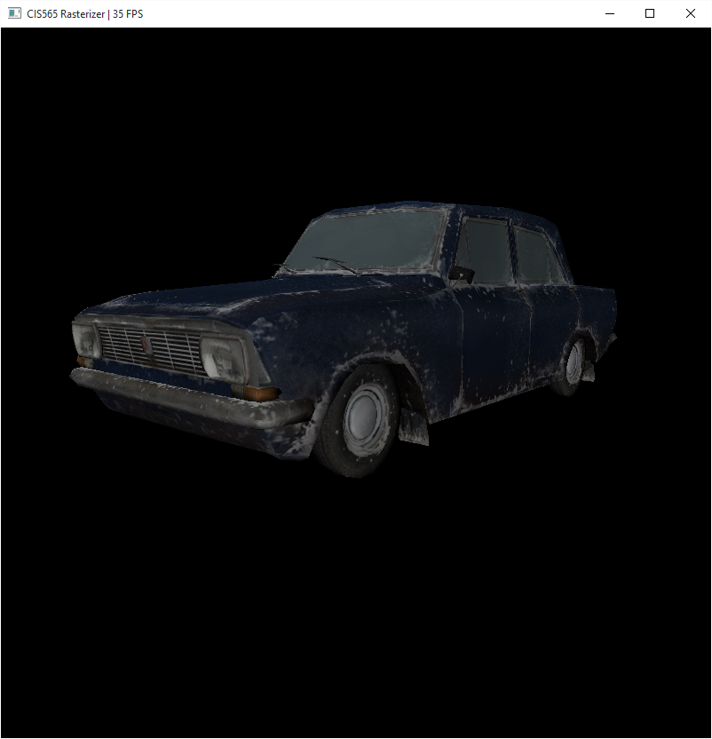

#### Shading mode
|complete| wireframe | vertex|
|--------------------------| --------------------|------|
|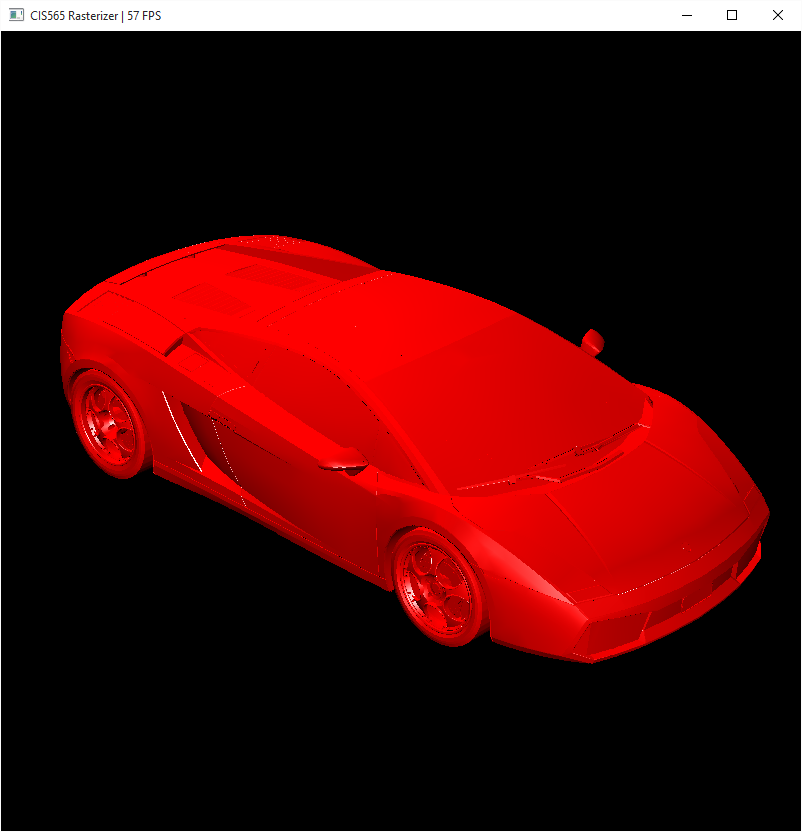 |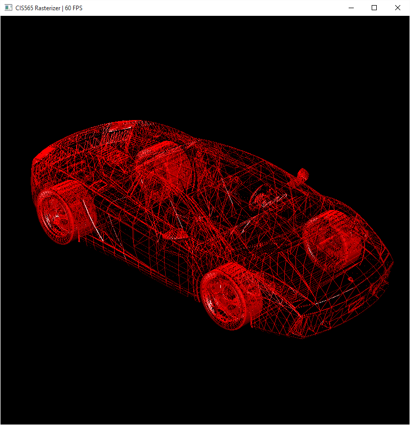 | 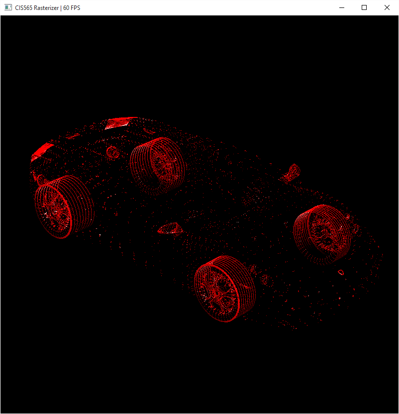|

#### Backface Culling
|without  | with backface culling |
|--------------------------| --------------------|
|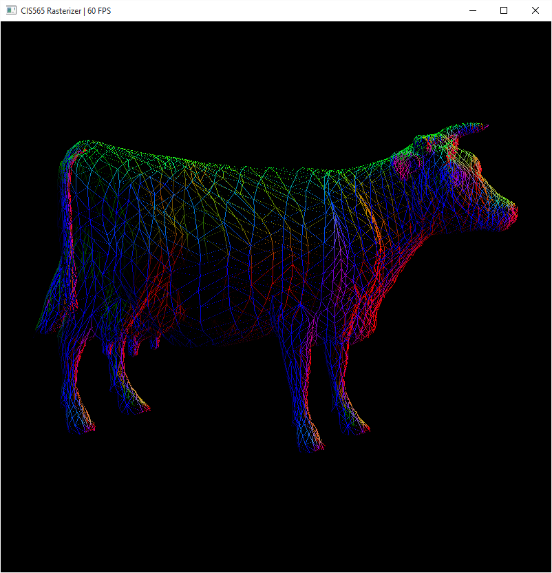 |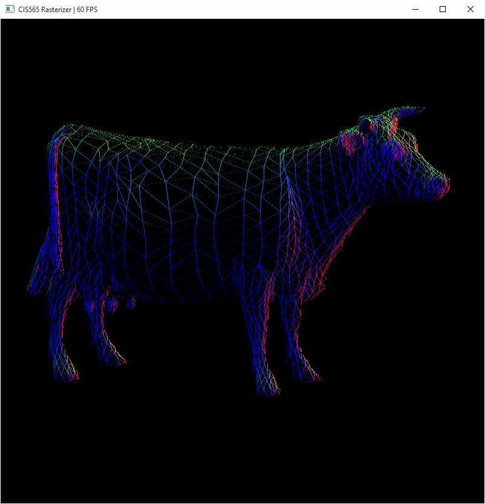 |

#### Antialiasing
|without  | with antialiasing |
|--------------------------| --------------------|
| |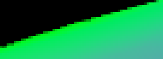 |

#### smooth interpolation
|normal without smooth | normal with smooth |
|--------------------------| --------------------|
|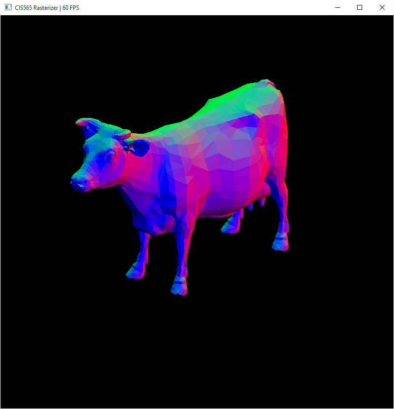 |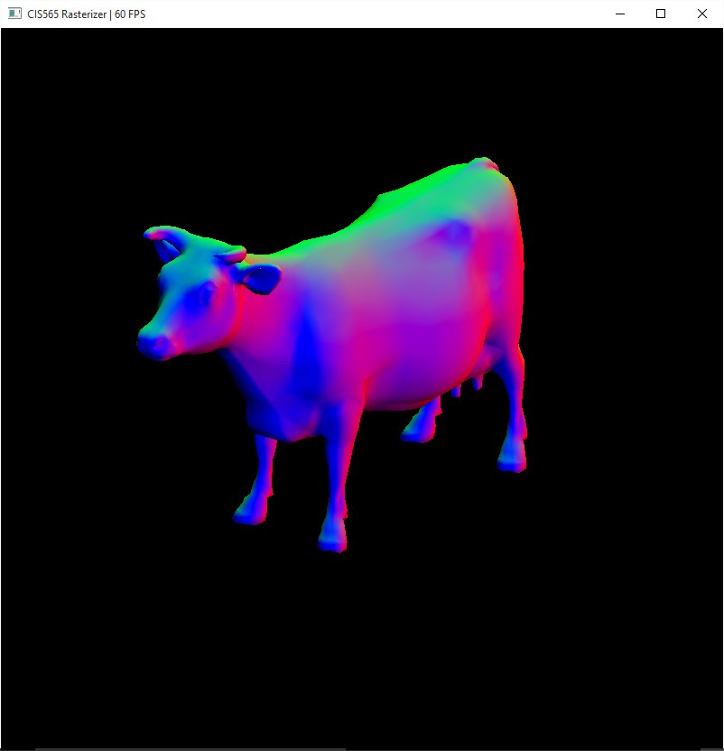 |

#### Scissor Test (easy and boring...)
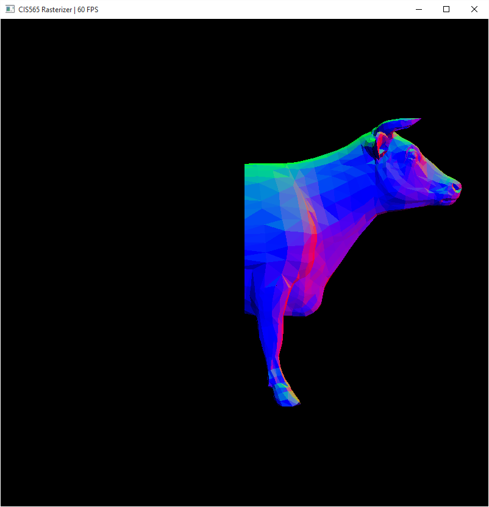

#### Huge obj try (improve from 0fps to 3fps...-_-!!!)
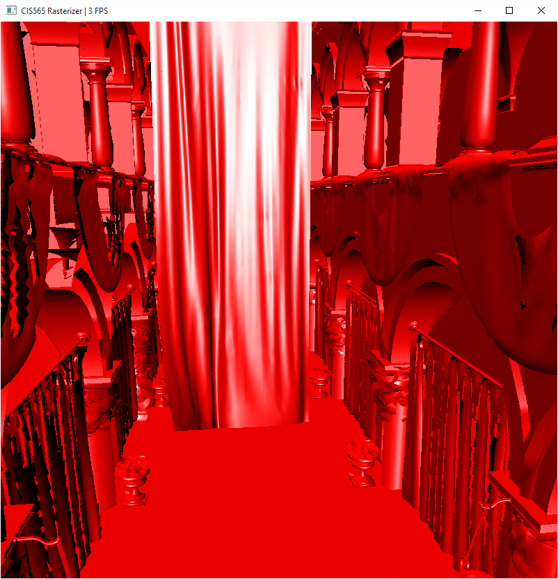

-----------------------------------
## Control

* `Mouse Left button` : Rotate
* `Mouse Right button` : Translate
* `Mouse Wheel`: Scale
* `b`: enable/disable backface culling
* `s`: switch shading mode : normal / phong shading on default material / phong shading with texture
* `w`: switch rasterization mode : complete / wireframe / vertex

## Outline
* [sss](#General-Intro)

## PipeLine Description

* Vertex Shader
takes in VertexIn list, apply the transformation to NDC space and outputs in VertexOut list. Every feature needs to divide w to make perspective correct interpolation (which is critical for texture mapping). 

* Primitive Assembly
takes in VertexOut list, assembles as primitives and output to Primitive list. This step can be merged into Vertex Shader, sharing the same kernel. 
	* __simple  clipping__
	discard the primitives that are totally out of the viewport. Which can improve performance when only a small fraction of the obj is in viewport. 

* Backface culling (optional)
uses thrust stream compaction to remove a primitive if it faces backward. Reduce the number of primitives for rasterization. However, the stream compaction itself costs time. So only when there's a large number of primitives will the impact be seen in FPS (sponza).

* Rasterization
Use Scanline algorithm for each triangle. Each thread handles one triangle. 
	* __pixel-walk scanline__: 	Instead of using a Bounding Box to scan, I calculate the two edge of a triangle that is currently enrolled in the scanning. With the dx and dz, I can move one pixel a time between x_left and x_right and do rasterization immediately. No need for testing if a point is in triangle. So I thought the scanline process can be faster. But turns out it slows down comparing to others result. I think it may because more kernels, functions and register are used (144 per thread...). (x2-x4 slower)
	* __supports for wire frame and vertex rasterize__: 	Different from a geometry shader, this approach changes rasterization method to support wire frame and vertex. This approach is simpler to implement and achieve visually good result. 
	* __antialiasing__: I implement antialiasing by picking several samples at the edge of the scanline, multiply the final value with a ratio of samples falling in the triangle. This leads to a wireframed image since each triangle are independent so samples out of its triangle cannot get value from other triangles. I fix this using some hacks in fragment shader. 
	* __depth_test__: When finish rasterization, it needs to be written to fragment shader. This needs to avoid racing condition. I use a int depth buffer and `atomicMin`, and turned the float z value to fixed point value. But there are still rare race issues on large obj(sponza). The possible reason is float limitation.  

* Fragment Shader
Each thread handle one fragment. color by normal, phong shading, or phong with texture
	* __texture mapping__: use the uv to pick color value from texture image and use bilinear filtering to eliminate blocky look. Bilinear filtering without mipmapping can be useful when scaling less than two times of original size or larger than half size. 
	* __scissor test__: This is implemented by discarding fragments out of the clipped rectangle. If a stencil mask is used, this can be useful when rendering a sniper's view. This only has an impact on performance when using an expensive fragment shader. 

## Performance Analysis

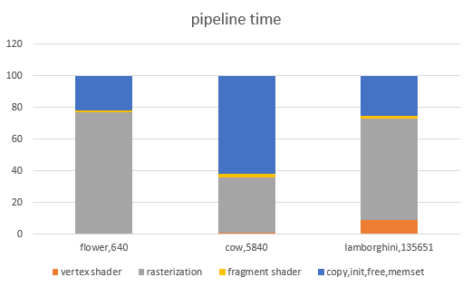

Vertex shader greatly depends on the number of vertex, while rasterization is related to how big the surfaces to scan are.

Doing this makes me realize my piece-walk scanline doesn't turn out to fit the GPU well. It needs up to 144 registers per thread which is a huge bottle neck. 

* Backculling
decrease 18% time consuming in rasterization on Lamborghini obj. 

Increase FPS from 0 to 3fps on sponza....

## Reference

* Transformation: http://www.songho.ca/opengl/gl_transform.html
* pixel-walk Scanline: Stanford CS248 Interactive Computer Graphics
* objs are from www.blend.org, tf3dm.com

