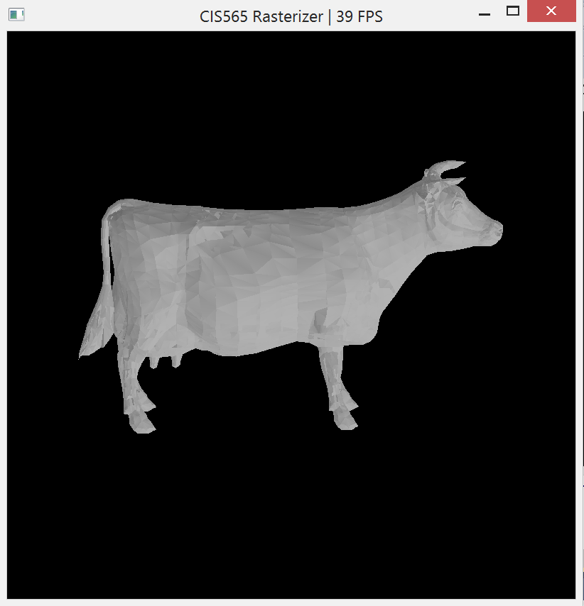

CUDA Rasterizer
===============

**University of Pennsylvania, CIS 565: GPU Programming and Architecture, Project 4**

* Sally Kong
* Tested on: Windows 8, i7-5500U CPU @ 2.40GHz 2.40 GHz, GEForce 920M (Personal)

A simplified rasterized graphics pipeline, similar to the OpenGL pipeline. I implemented a vertex shader, primitive assembly, rasterization, and a fragment shader (lambert).

### Sample Image of a cow

