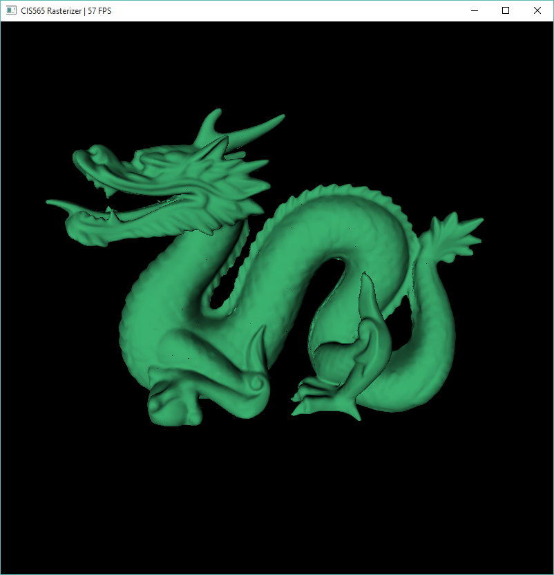
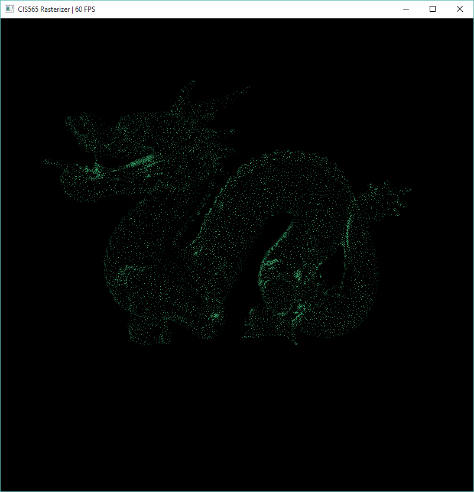
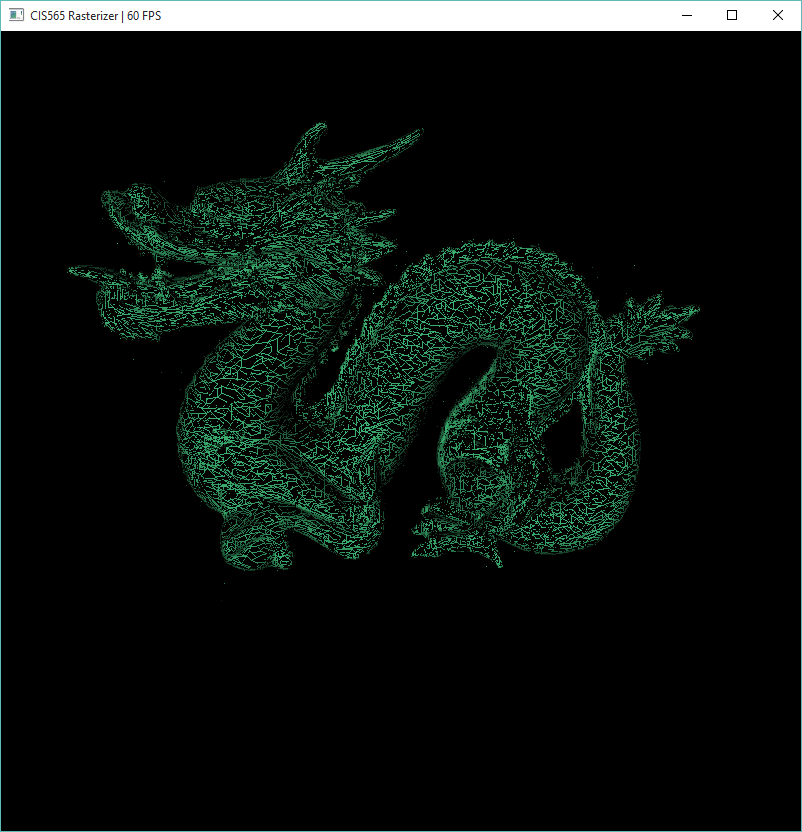

CUDA Rasterizer
===============

**University of Pennsylvania, CIS 565: GPU Programming and Architecture, Project 4**

* Bradley Crusco
* Tested on: Windows 10, i7-3770K @ 3.50GHz 16GB, 2 x GTX 980 4096MB (Personal Computer)

## Description
An interactive GPU accelerated rasterizer (Add here)

## Pipeline

### Vertex Shading

### Primitive Assembly

### Backface Culling (Optional)

* **Overview**: Backface culling is a relatively simple procedure added to the pipeline as an option after the primitive assembly step. The step determines which primitives are facing the camera, and marks those that are not as not visible. After this has been done for all primitives, stream compaction is run on the resulting array of primitives and those that are not visible are removed from the pipeline. To determine if a primitive is facing the camera, we use the dot product between the vector from the camera to the model's position and the normal of the primitive.
* **Perfromance Impact**:
* 

### Scissor Test (Optional)

* **Overview**: The scissor test is another relatively simple stage added as an option to the pipeline. In the scene in the program, a rectangular portion of the screen can be defined as the bounds of this scissor clipping. Anything outside the bounds will be clipped from the scene. Whether a primitive is to be displayed is determined by checking the maximum and minimum points on the primitive's bounding box and comparing those positions to the dimensions of the rectangle defining our culling area. If the max or min of the bounding box lays outside this area, the primitive is marked as not visible. Once we've run the test on all the primitives in the scene, stream compaction is used to remove the invalid primitives from the array.
* **Perfromance Impact**:
* 

### Rasterization

#### Triangles

#### Points

* **Overview**: For this effect, the standard rasterization step of the pipeline is replaced with one to output points. Because we are only rendering a point and not an entire triangle, bary centric coordinates do not need to be calculated, nor do we have to interpolate the normals or colors across each verticy. Instead we just output the values for a single vertex to the depth buffer (I use the middle vertex at index one) and lead the others as zero. This vertex will be the point that is rendered to the screen.
* **Perfromance Impact**:
* 

#### Lines

* **Overview**: The implementation for lines is more complicated than the other two primitives. For ease of implementation, I render the line between the first and second verticies of a the triangle primitives. There are two situations that need to be handled when rendering these. The first is the simplest case, when the line to render is a straight vertical line. Here we loop between the min and end values in the y direction and render as we travel along. For all other lines we must calculate a Bresenham line, is a method of approximating the rasterization of a line. Otherwise it works just like rendering the vertical line, with the main difference being a loop along the x direction while using the slope of the line to calculate a y value in the correct position at each iteration of the loop, and z is determined using the depth test.
* **Perfromance Impact**:
* 

### Fragment Shading

#### Normal and Color Interpolation

* **Overview**:
* **Perfromance Impact**:
* 

### Fragments to Depth Buffer?

Fragment to framebuffer?

## Additional Features

### Mouse Controls

## Performance Analysis
