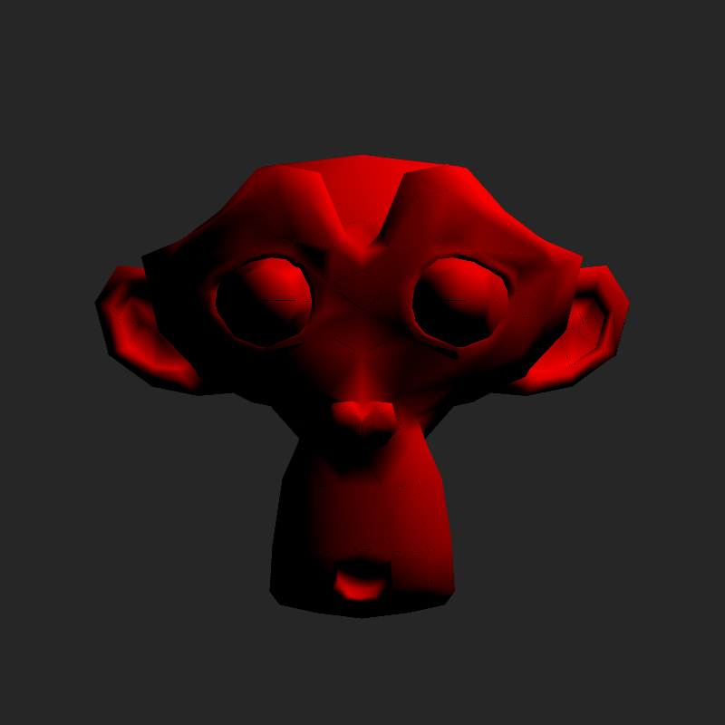
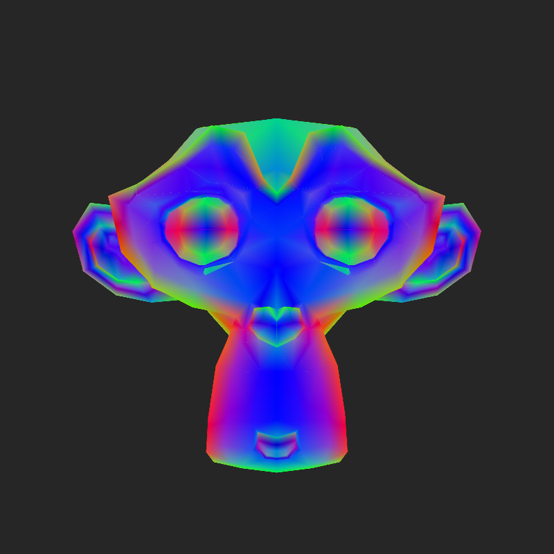
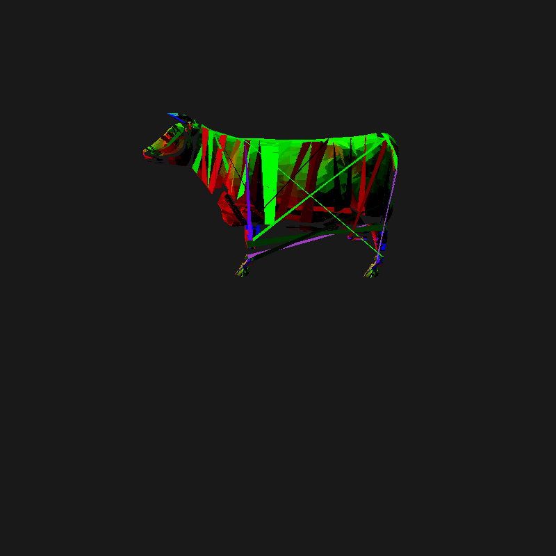
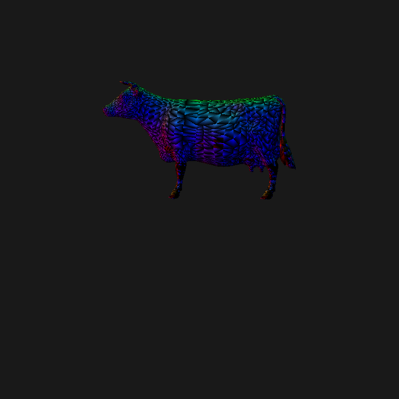
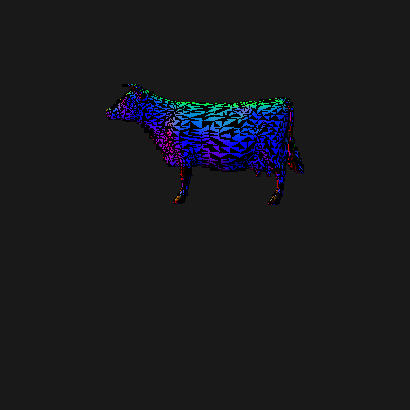

CUDA Rasterizer
===============

**University of Pennsylvania, CIS 565: GPU Programming and Architecture, Project 4**

Terry Sun; Arch Linux, Intel i5-4670, GTX 750

This project contains a simplied graphics pipeline implemented in CUDA.

## Pipeline Overview

1. Vertex shader: applies a model-view-projection transformation to each
   input vertex. Parallelized across vertices.

2. Primitive assembly: reads in indices and transformed vertices and assembles
   primitives (triangles). Parallelized across primitives.

3. Geometry shader: after primitives are assembled, the geometry shader
   generates more (or fewer) triangles for each existing triangle, up to a fixed
   N for each triangle. Examples of this are (fixed-number) tesselation and
   backface culling (both implemented).

3. Rasterization: uses a scanline algorithm to determine which fragments are
   covered by a particular primitive, performs depth testing, and stores into a
   depth buffer. Uses an axis-aligned bounding box for optimization, barycentric
   coordinate checking to test coverage, and CUDA `atomicMin` to avoid race
   conditions when doing depth testing. Parallelized across primitives.

4. Fragment shading: computes color of each pixel using Lambert (diffuse)
   shading. Interpolates normals within a triangle. Parallelized across
   fragments.

## Features

### Geometry shader + backface culling

### Color interpolation

For every point, its normal is interpolated from its relative distance from the
3 vertices of its triangle. This is calculated using barycentric coordinates.
This normal is then used to calculate a Lambert (diffuse) shading, which is
smooth.

### Antialiasing

TODO: image

Four fragments are generated for every pixel, spaced evenly within the pixel. In
general this is parallelized 

### Scissor test

Clipping optimization. Define a `glm::vec4(xmin, xmax, ymin, ymax)` window in
which to render to the screen. When performing scanline rasterization algorithm,
this test discards data outside of this window.

## Internals

# Bloopers

First cow render: wasn't using indices to assemble primitives.

Not sure what was going on: bad interpolation? Only one vertex in each triangle
has color.

Lots of race conditions: imagine this but with flickering on most triangles. It
was hard to look at.
