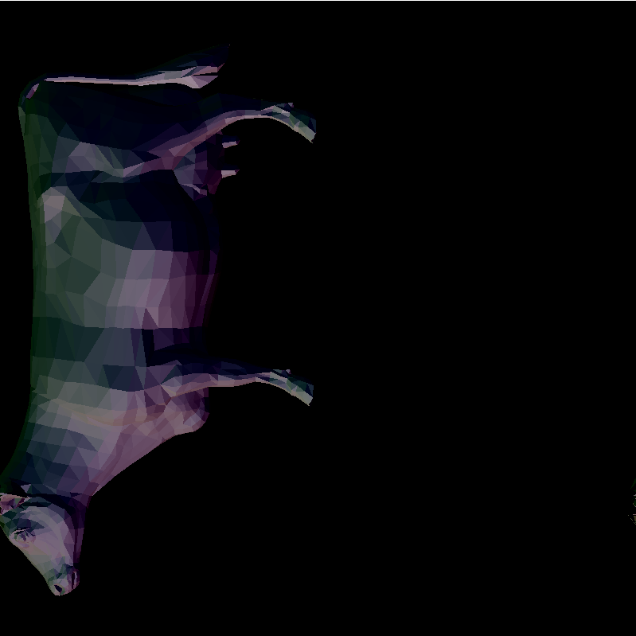

CUDA Rasterizer
===============

**University of Pennsylvania, CIS 565: GPU Programming and Architecture, Project 4**

* Xinyue zhu
* Tested on: Windows 10, i7- @ 2.22GHz 22GB, GTX 960M

========================
## Description:
 
This is a rasterizer.

  It includes the following pipeline:
1)vertex transformation with camera movement 
2)Tessellation shader
3)Bling-phong shader and blending
4)rasterization brute force scan line->boundingbox scan line
4)depth test
the base color is normal map

* A brief description of the project and the specific features you implemented.
* At least one screenshot of your project running.
* A 30 second or longer video of your project running.
* A performance analysis (described below).

### Performance Analysis

The performance analysis is where you will investigate how to make your CUDA
programs more efficient using the skills you've learned in class. You must have
performed at least one experiment on your code to investigate the positive or
negative effects on performance. 

We encourage you to get creative with your tweaks. Consider places in your code
that could be considered bottlenecks and try to improve them. 

Provide summary of your optimizations (no more than one page), along with
tables and or graphs to visually explain any performance differences.

* Include a breakdown of time spent in each pipeline stage for a few different
  models. It is suggested that you use pie charts or 100% stacked bar charts.
* For optimization steps (like backface culling), include a performance
  comparison to show the effectiveness.

