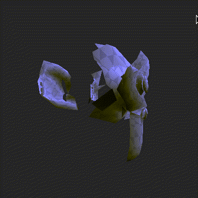
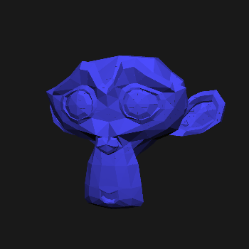
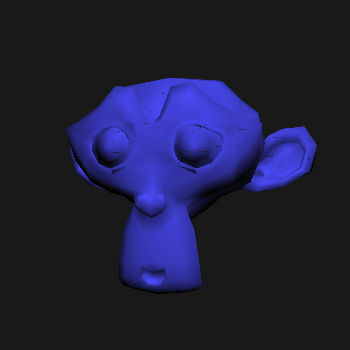
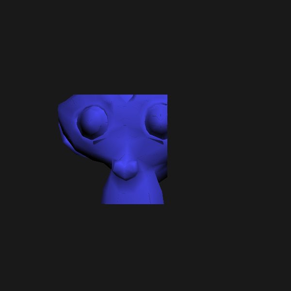
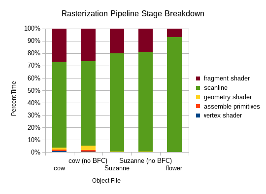
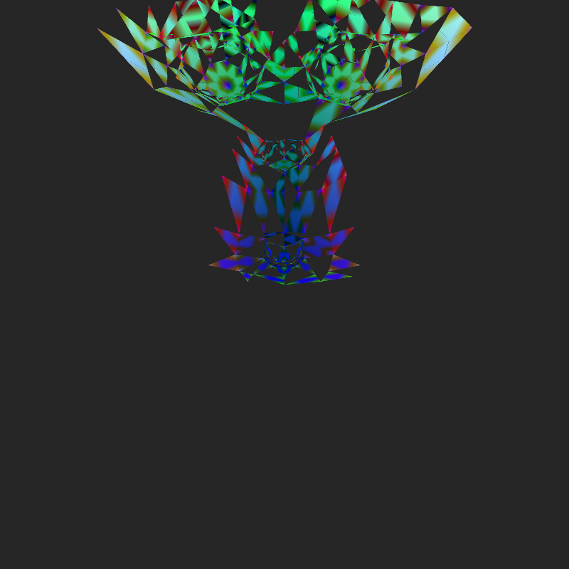

CUDA Rasterizer
===============

**University of Pennsylvania, CIS 565: GPU Programming and Architecture, Project 4**

Terry Sun; Arch Linux, Intel i5-4670, GTX 750

This project contains a simplied graphics pipeline implemented in CUDA.

## Pipeline Overview

1. Vertex shader: applies a model-view-projection transformation to each
   input vertex. Parallelized across vertices.

2. Primitive assembly: reads in indices and transformed vertices and assembles
   primitives (triangles). Parallelized across primitives.

3. Geometry shader: after primitives are assembled, the geometry shader
   performs additional primitive generation (or deletion), up to a fixed factor
   (4) per original primitive.

   1. Backface culling: triangles that face away from the camera are removed.
      `thrust::remove_if` stream compaction is used to filter these out before
      rasterization occurs.

   2. Tessellation shading/smoothing: Each triangle is subdivided into 4 smaller
      triangles, with interpolated normals.

4. Rasterization: uses a scanline algorithm to determine which fragments are
   covered by a particular primitive, performs depth testing, and stores into a
   depth buffer. Uses an axis-aligned bounding box for optimization, barycentric
   coordinate checking to test coverage, and CUDA `atomicMin` to avoid race
   conditions when doing depth testing. Parallelized across primitives.

5. Fragment shading: computes color of each pixel using Lambert (diffuse)
   shading. Interpolates normals within a triangle. Parallelized across
   fragments.

6. Copy to screen/frame buffer.

## Features

### Geometry shader

**Backface culling**. Triangles which do not face the camera are removed before
rasterization. Triangles are tested by computing the cross product between the
edges (v0-v1, v0-v2); by convention, triangles which face away from the front of
the model will be defined such that this cross product has a negative z
component. ([source][bfc-wiki])

  [bfc-wiki]: https://en.wikipedia.org/wiki/Back-face_culling)

Back-facing faces are stream compacted away. This improves the execution
warp coherency because all threads going through the scanline function are
guaranteed to draw to at least one pixel on the screen.

(In this example the back direction is fixed relative to the model in order to
demonstrate missing faces. In practice, backface culling would be invisible to
the viewer.)

*Tessellation geometry shading*. A second geometry shader divides each triangle
into 4 smaller triangles (see left, below). Three new vertices are generated
from each existing triangle. The vertex transformation must be applied again to
each of these vertices, thus blurring the pipeline stages. (I considered moving
the entire vertex shader to within geometry shader, but made the optimization of
splitting the vertex shader out and transforming the original vertices once.)

Below: the middle triangle of the 4 generated triangles is colored lightly to
show the pattern of tessellation.

### Color interpolation

For every point, its normal is interpolated from its relative distance from the
3 vertices of its triangle. This is calculated using barycentric coordinates.
This normal is then used to calculate a Lambert (diffuse) shading (plus a small
amount of ambient lighting).

Comparison of non-interpolated and interpolated normals:

Animation of a light moving across the screen:

### Antialiasing

Four fragments are generated for every pixel, spaced evenly within the pixel.
The parallelization for this process varies between stages. In some (fragment
shader), a thread is launched for each fragment; however, in others (scanline),
a single thread will handle four fragments in succession. Future work might be
to do analysis on methods of parallelizing this multi-fragmented approach.

At the very end of the pipeline, as fragments are translated into colors for the
frame buffer, the four pixels associated with a frame are averaged together.

### Scissor test

Clipping optimization. Define a `glm::vec4(xmin, xmax, ymin, ymax)` window in
which to render to the screen. When performing scanline rasterization algorithm,
this test discards data outside of this window.

## Performance

### Breakdown by Stage

By far the longest stage is the rasterization/scanline function. Many of the
other stages are completely inconsequential in comparison, as expected -- very
little computational work is done in the primitive assembly (mostly memory
access) or vertex shader step. It surprised me that the fragment shader is the
second largest stage and by that margin.

A future work possibility is to use a more optimized scanline function or use a
different rasterization technique altogether.

### Backface Culling

Data in this case taken *with* triangle subdivision active.

File    | Triangles Orig | Triangles after BFC | % Removed | Time Orig | Time AFter | % Speedup
--------|----------------|---------------------|-----------|-----------|------------|----------
Cow     | 23216 | 9352 | 59.7% | 13.21 | 12.94 | 2.02%
Suzanne | 3862 | 2576 | 33.3% | 22.2 | 20.83 | 6.17%

I'm surprised that backface culling doesn't provide a better result.G

(There was no difference at all in flower.obj, so it's left out of these
results.)

Note to self: should have kept the image rotation on while taking this data for
better variety.

## Internals

## Bloopers

First cow render: wasn't using indices to assemble primitives.

Not sure what was going on: bad interpolation? Only one vertex in each triangle
has color.

Lots of race conditions: imagine this but with flickering on most triangles. It
was hard to look at.

A somewhat terrifying mistake from when I started doing triangle subdivision.
