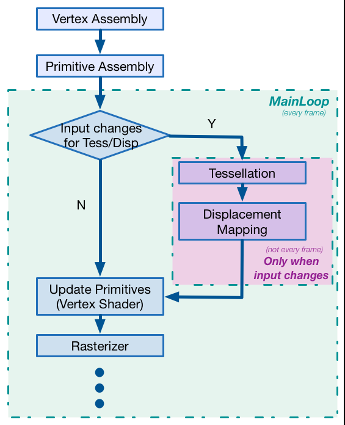
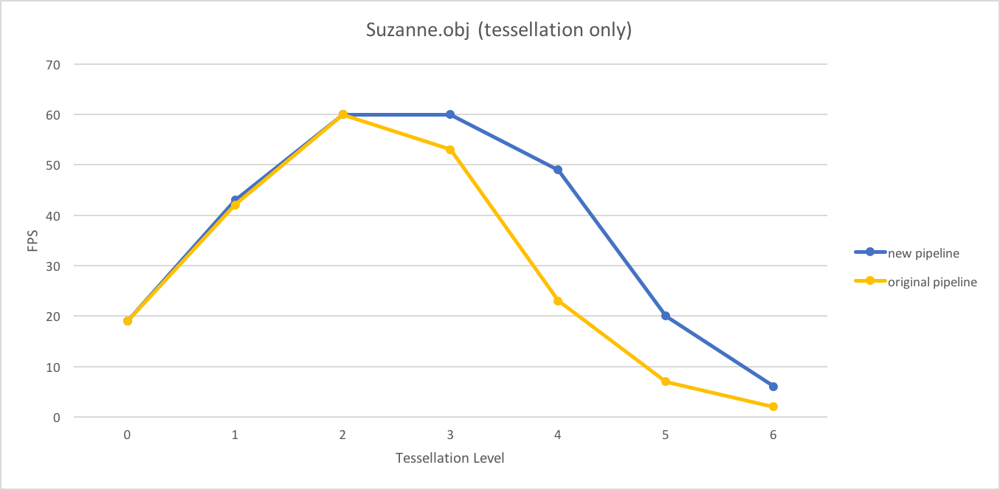
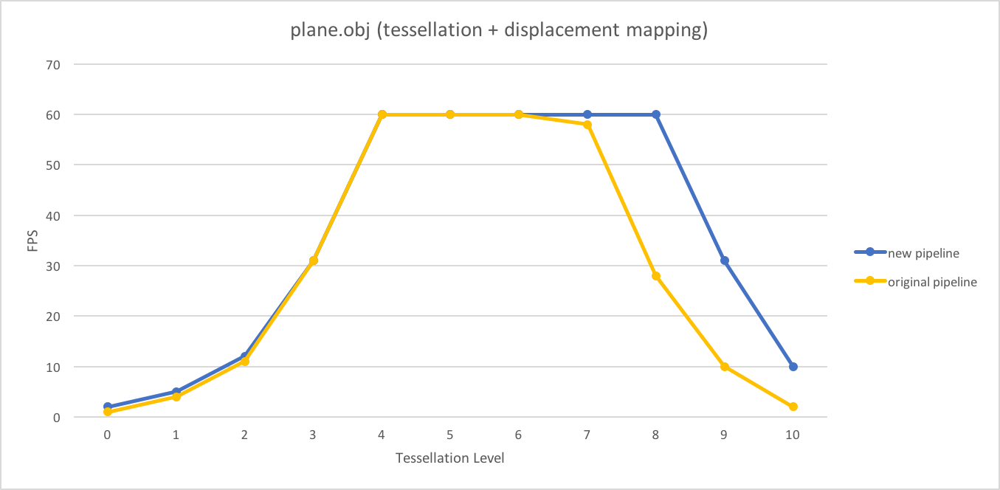

CUDA Rasterizer
===============

**University of Pennsylvania, CIS 565: GPU Programming and Architecture, Project 4**

* Ziwei Zong
* Tested on: Windows 10, i7-5500 @ 2.40GHz 8GB, GTX 950M (Personal)

Overview
========================

[Demo Pic]

Description here:...

#### Controls

|  KEY/Mouse	|   Function						| Demo Image				|
|---------------|-----------------------------------|---------------------------|
|Left Mouse		| Rotate							|  [pic]					|
|Middle Mouse	| Zoom								|  [pic]					|
|Right Mouse	| Move								|  [pic]					|
|Key '0'		| Wireframe only					|  [pic]					|
|Key '1'		|     Color							|  [pic]					|
|Key 'w'		| turn wireframe on/off				|	|
|Key 't'		| turn texture on/off			    |  [pic]					|
|Key 'n'		|  normal testing					|  [pic]					|
|Key 'd'		| turn displacement mapping on/off  |  [pic]					|
|Key Up/Down	|increase/reduce tessellation level |  [pic]					|
|Key Left/Right	|increase/reduce texture repeat		|  [pic]					|

Features
========================

#### Tessellation

#### Texture Mapping

**Bilinear Texture Filtering:** 

**Texture Repeat:** 

#### Displacement Mapping

#### Interpolation

**Normal**

**Color**

Performance Analysis
========================

#### Pipeline Optimization

description here...

* New pipeline for tessellation analysis

* New pipeline for tessellation and displacement mapping analysis

#### Obj Analysis

References
========================

**Mouse Control**

**Tessellation**

**Texture Mapping**

**Displacement Map**

To Do...
========================
1. cannot tessellate cow.obj
2. cannot open sponza.obj
3. Smooth Tessellation
4. seperate textuers