Tile-based CUDA Rasterizer
===============

**University of Pennsylvania, CIS 565: GPU Programming and Architecture, Project 4**

* Tongbo Sui
* Tested on: Windows 10, i5-3320M @ 2.60GHz 8GB, NVS 5400M 2GB (Personal)

## Overview
An efficient CUDA rasterizer with two pipeline options. By default it uses tile-based rendering, but also supports scanline rendering (`L` to switch between).

## Video Demo

###### Tile-based render demo
[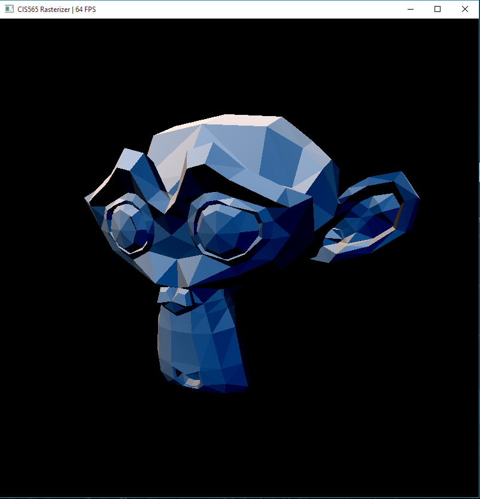](https://youtu.be/xNBfuONQN48)

###### Scanline demo
[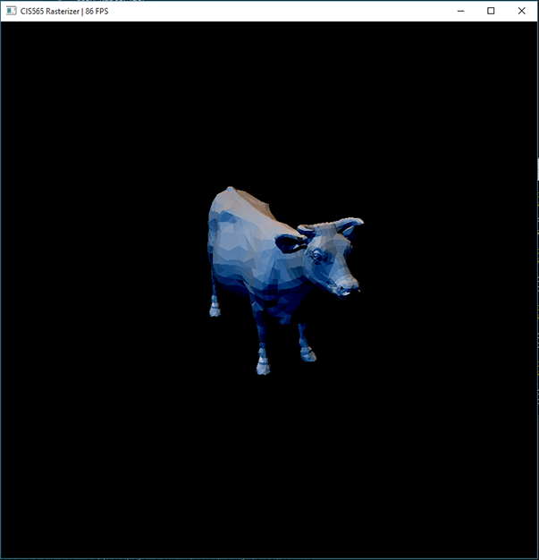](https://vimeo.com/141638182)

## Quick Jump List  
* [Scanline pipeline](#pipeline-overview-scanline)
* [Tile-based pipeline](#pipeline-overview-tile-based)
* [Misc features](#misc-features)
* [Performance analysis](#performance-analysis)
* [References](#references)

## Pipeline Overview (Scanline)

* Vertex shading
  * Vertex shader with perspective transformation. Takes in vertices and transform the coordinates to window coordinates
* Primitive assembly
  * Assembles triangles from the list of vertices
  * Calculates AABB bounding box for each triangle
  * Initializes primitive properties for shading later
* Geometry shader (optional)
  * `G` toggle geometry shader
  * For each triangle's first vertex, draw a line to demonstrate the vertex's normal
  * Shader has the ability to output at most 8 primitives for each input primitive
  * Shader output is optimized via stream compaction, where unused storage is trimmed
  * Analysis
    * Performance impact: on average 2x slower, since the current shader outputs 2 primitives per input primitive
    * Optimization: stream compaction is used to trim down the output array size
    * Possible improvement: it might be better to simply refrain from using any compaction method, but direcly indexing the primitives during rasterization. This way the stream compaction overhead can be avoided. However it adds complexity to the next stage in the pipeline

###### Geometry shader. Hairs are vertex normals
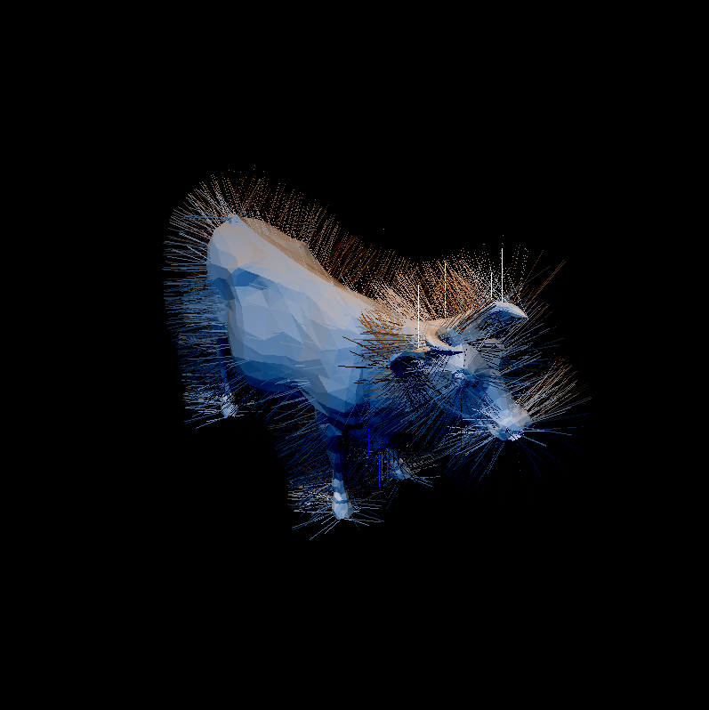

* Backface culling (optional)
  * `B` toggle
  * Marks all backfaces, then remove them using stream compaction
  * Analysis
    * Performance impact: varying impact on performance (see below in Performance Analysis)
    * Optimization: stream compaction is used to trim down the output array size
    * Possible improvement: same as geometry shader. In this case there is actually strong evidence that stream compaction overhead might be too significant

###### Backface culling. Notice that backface normals are removed
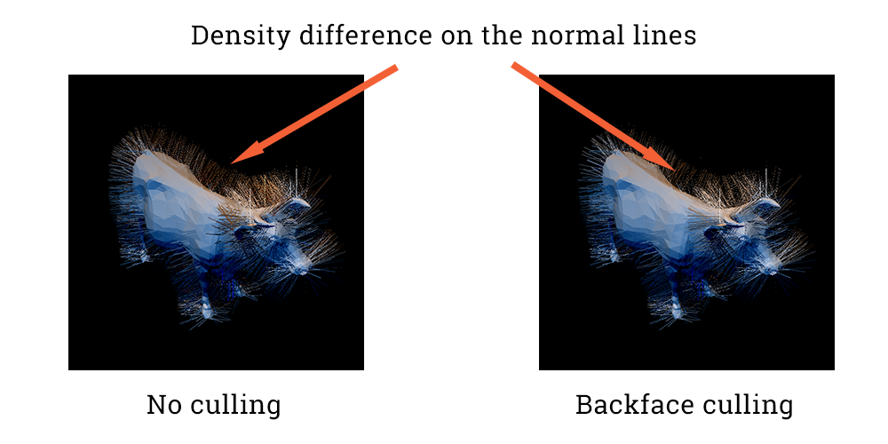

* Rasterization
  * Rasterize input primitives. Uses scanline algorithm
    * Each thread takes care of one triangle, and scans every pixel inside the triangle's bounding box
    * Supports lines and points
        * Does **not** support vertex shading and assembly for such primitives; only rasterization
        * Analysis
          * Performance impact: no visible direct impact; however if point shader is enabled, the scene would render much faster since the rasterization logic is dramatically simplified
          * Optimization: various kernel optimization techniques, including reordering to reduce execution dependency, and removing cache variables for lower memory dependency and higher cache hit rate
          * Possible improvement: faster algorithm to rasterize the primitive
  * Sub-pipeline
    * Pre-clipping
      * Window clipping: remove fragments outside window by directly shrinking the scan bounding box
      * Scissor test (optional): same as window clipping, and further shrinks the scan bounding box
        * `S` toggle scissor test
        * Analysis
          * Performance impact: direct positive impact, but only when the object is partially inside the scissor box. Even in that case, the impact is small around ~10FPS
          * Optimization: clipping before scaning, instead of discarding fragment during scan, essentially decreases the amount of computation needed for clipped primitives
          * Possible improvement: may be a faster calculation for the scissor box clipping
    * Each thread scans each pixel in the triangle's bounding box
      * Subject to primitive size in window coordinate; the bigger, the slower
        * For the same object, camera being further away results in smaller object screen size; thus higher FPS
        * On the other hand, camera being very close results in each primitive covering big proportion of screen; thus each thread scans longer; thus lower FPS
      * The overhead of calculating and sorting intersection points per scanline cancels out the benefit that such points can shrink the scan range. Scanning every pixel is actually faster in general
    * Depth test
      * Directly testing the current calculated depth with the shallowest
      * Write to buffer if it wins the depth test, using atomics to avoid races
      * Use barycentric interpolation for color, position and normal. Thus it enables rendering of flat-shade objects, as well as smooth objects
      * Analysis on barycentric interpolatoin
        * Performance impact: no visible impact
        * Optimization: none
        * Possible improvement: none

###### Scissor test. Fragments outside the scissor box are clipped
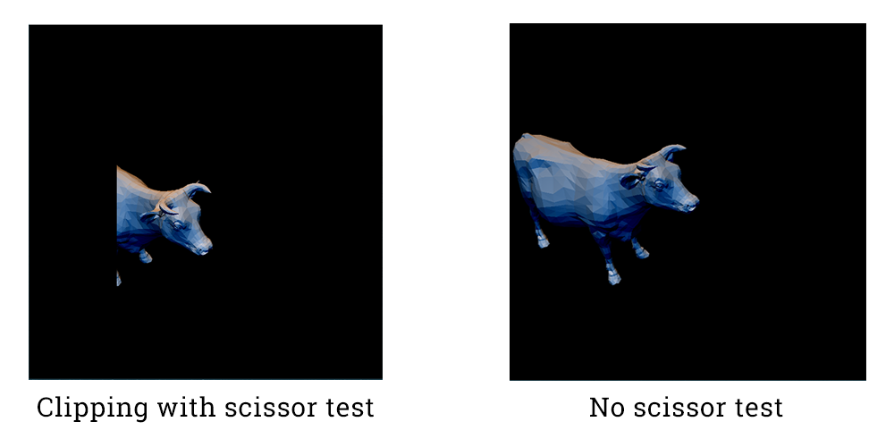

* Fragment shading
  * Simple Lambert shader
  * Each fragment is shaded with two fixed lights

###### Lambert shading with barycentric interpolation. Two lights are used to better demonstrate the effect
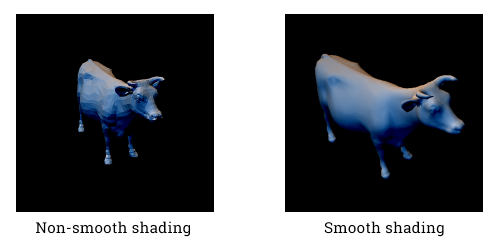

## Pipeline Overview (Tile-based) 

* Use `L` to switch between pipelines
* Concept
  * Divide-and-conquer technique applied to the pixel array, instead of primitive array
  * Image is first divided into fix-sized bins. Such bins are relatively big in pixel size (e.g. 128x128 px). A kernel is launched to examine bounding box overlapping for each primitive against all bins
    * Each bin maintains a queue of overlapping primitives
  * Each bin is then divided into smaller sized tiles (e.g. 8x8 px). A kernel is launched to further examine bounding box overlapping for each bin for each primitive *in the bin's queue*
    * Each tile maintains a similar queue
  * Then a kernel is launched to find exact intersections for each pixel. In this case each pixel only needs to examine the primitives in the tile's queue
* **NOTE**
  * The lightings are different for the two pipelines to make it easier distinguishing the current pipeline. Tile-based render has major lighting coming from top left. Scanline render has major lighting coming from top right
  * LIMITATION: current tile-based implementation imposes limitation that there can be at most 1024 triangles covering each bin at the same time. More triangles will result in undefined clipping
    * Current workaround:
      * Adjust bin size so that less triangles will cover one single bin
      * Zoom in more so that triangles get spaced out instead of clutching within several bins
    * Possible solution: all it needed is a thread-safe, dynamically resizable queue for each bin. This is not included in the implementation and hence the limitation. Theoretical limitation with such data structure is the memory limit of the hardware 
* Vertex shading: same as scanline
* Primitive assembly
  * Assembles triangles from the input vertex list
  * Initialize various shading property
  * Flip coordinates to offset coordinate difference in OpenGL
  * Cache minimum depth. This is the minimum depth of the 3 vertices of each triangle
  * Pre-calculate signed area, and remove backfaces and degenerate faces
  * Coarse window & scissor clipping. Removes those that are completely outside of the clipping box
* Primitive compaction
  * A simple stream compaction step to actually remove the marked primitives from previous stage
* Geometry shader
  * Same as scanline, with slight change that also calculates bounding box of the newly added geometries
* Bin rasterizer
  * Take the primitives as input, each thread is responsible for one single primitive. The thread will check coverage with all bins in the image, and push its primitive ID to that bin's coverage list, should there be any overlapping
* Tile rasterizer
  * Take the previous coverage list as input. Each thread is responsible for one tile, and will check coverage in the bin's list
* Fine rasterizer
  * Take the previous coverage list as input. Each thread is responsible for one pixel, and will check coverage in the tile's list
* Fragment shader
  * Same as scanline. Only that it now distinguishes a fragment that isn't overlapping any primitives with one that does
  * It will directly shade a non-overlapping fragment to black, while shade the "good" fragments with correct lighting

## Misc Features
* Mouse-based interactive camera support
  * Controls
    * `Left button` hold and drag: rotate
    * `Right button` hold and drag: pan
    * Scroll: zoom
    * `SPACE`: reset camera to default
  * Performance impact: no visible impact
* `N`: fragment shader will use normal vector as color vector; enable to see fragment normals

###### Normal shading
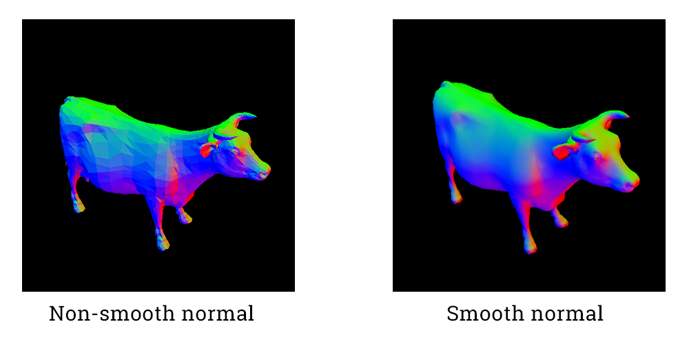

* `R`: reset to color shading (use fragment color for shaded color, instead of fragment normal)
* `P`: toggle point shader; only shows shaded vertices instead of all fragments
  * Not compatible with geometry shader because it will set all primitives to point; rasterization will still work, but the two effects won't show at the same time

###### Point shading
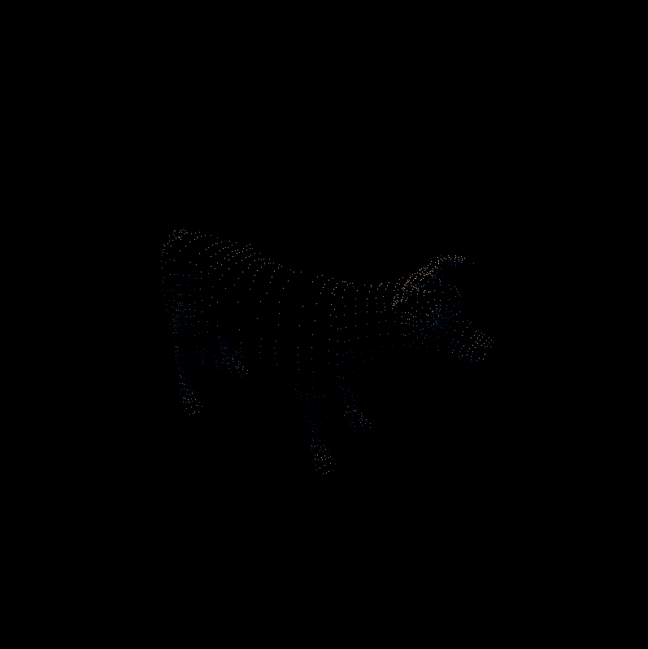

## Performance Analysis

* Camera properties
  * Position `(0,0,3)`
  * LookAt `(0,0,0)`
  * FOV = 45.0 degrees

* Tile-based performance breakdown
  * Fragement shader time is almost fixed. Only dependent on window size
  * Breakdown are core pipeline only
  * Unlike scanline (below), FPS doesn't have obvious changes when changing camera distance. The performance depends more on # of overlapping primitives in each tile. Thus scenes of high depth complexity would have the highest negative impact on performance

###### `cow.obj` performance breakdown
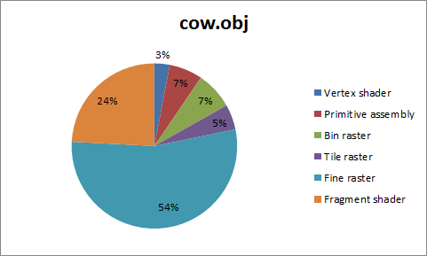

###### `cow.obj` FPS comparison by camera distance and pipeline. Positive means camera moving away
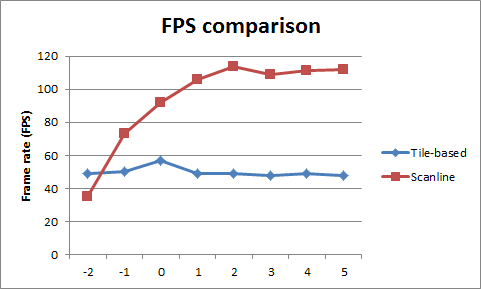

* Scanline performance breakdown
  * Fragement shader time is almost fixed, since it's only dependent on the pixel count of the output window
  * Breakdown are core pipeline only
  * For the exact same camera properties described above, frame rate largely depends on the transformed size of the primitives, due to the current rasterization implementation
    * `suzanne.obj` and `flower.obj` see increased frame rate when camera moves away from the object, yielding smaller transformed primitive sizes
  * For `cow.obj`, camera moving away is not as effective. This may due to the fact that the performance limit of current implementation has been reached

###### `cow.obj` performance breakdown
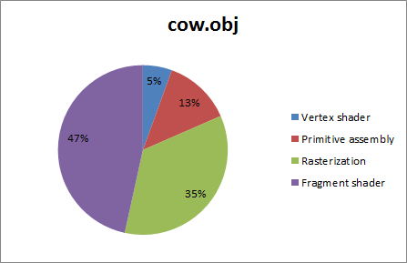

###### `cow.obj` FPS by camera distance, camera moving away
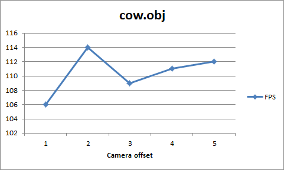

###### `suzanne.obj` performance breakdown
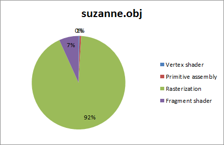

###### `suzanne.obj` FPS by camera distance, camera moving away
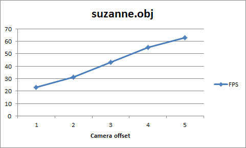

###### `flower.obj` performance breakdown
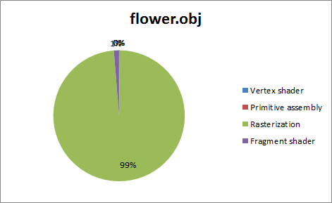

###### `flower.obj` FPS by camera distance, camera moving away
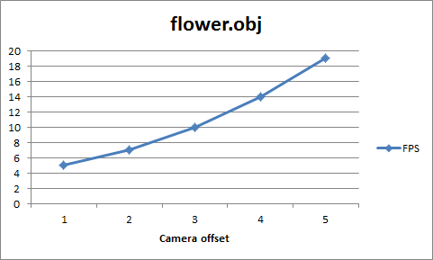

* Optimization (`cow.obj`)
  * Kernel: minor improvements (~10FPS)
    * Alter block size for different kernels to achieve higher warp count
    * Substitute fixed divisions with corresponding multiplications for marginal performance gain
    * Cache repetitive calculations; reorder executions to reduce execution dependency
    * Optimize calculations to reduce register usage
  * Backface culling (for scanline)
    * Only useful when the object is big in window
      * Reduces rasterization time
    * Stream compaction overhead might be more significant and cancel out the benefit

###### Backface culling performance impact
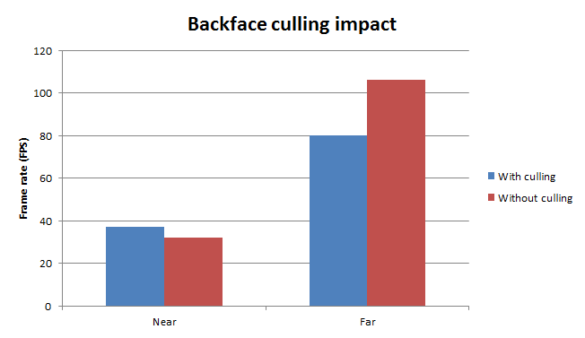

## References

* Line segment intersection test
  * http://paulbourke.net/geometry/pointlineplane/
* Vertex shader transformation
  * http://www.songho.ca/opengl/gl_transform.html
* Bresenham's line algorithm
  * https://en.wikipedia.org/wiki/Bresenham%27s_line_algorithm
* Tile-based rendering
  * https://mediatech.aalto.fi/~samuli/publications/laine2011hpg_paper.pdf
