CUDA Rasterizer
===============

**University of Pennsylvania, CIS 565: GPU Programming and Architecture, Project 4**

* Megan Moore
* Tested on:  Windows 7, i7-4770 @ 3.10GHz 32GB (Sig Lab)

**Summary:** 
In this project, I used CUDA to implement a simplified
rasterized graphics pipeline, similar to the OpenGL pipeline. I
implemented vertex shading, primitive assembly, rasterization, fragment shading,
and a framebuffer. 

* Final Images

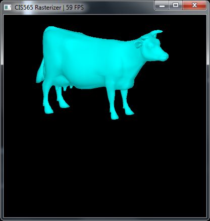  

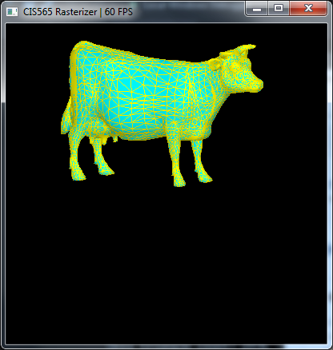 

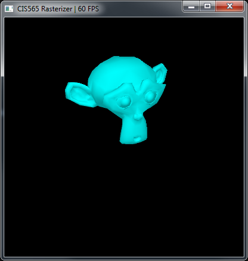 

* Vertex Shader
 * In the vertex shader, I took the local coordinates of each triangle and converted them into world coordinates.  To do this, I multiplied the local coordinates by the model, view, and projection matrix.  OpenGl is used to create the view and projection matrices, inputing the camera's location, where it is looking, along with the near and far clippinig planes.  Along with transforming the vertices, the normals were also transformed.  However, the normals were multiplied by the inverse transpose of the model matrix.  This is because the normals are vectors, not points like the vertices.  Thus, we have to transform them differently.
 
* Primitive assembly with support for triangles read from buffers of index and
  vertex data
 * The newly transformed vertices are passed into the primitive assembler.  The output of this function are all the triangles that are in the model.  Each vertex is passed into the primitve assembler, and based on it's index, it is placed into a new triangle.  The triangle struct holds three VertexOuts and a boolean that says whether it is backfacing or not.  After this implementation, I was able to get the output shown below. 

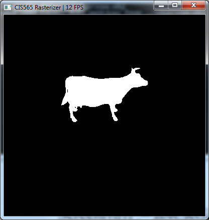
 
* Rasterization
 * The rasterizer does most of the work.  Here, each triangle is passed into the function, and it loops through every fragment to determine if the triangle is in that fragment.  The depth test is done here, along with antialiasing.  With each fragment, we calculate the barycentric coordinates with respect to the given triangle.  These coordinates tell us whether the fragment is in the triangle.  Then, the depth test is done.  If the depth of the triangle at that fragment is lower than any other triangle at that fragment, then the fragment should show that particular triangle.  AtomicMin is used to check the depth.  This function is needed when using the GPU because all threads are being run at once, we need an uninterupted function, since multiple threads could be trying to access the fragment's depth value.  Including the depth test allowed for a much better output.  It changed the image below on the left to the image on the right.

 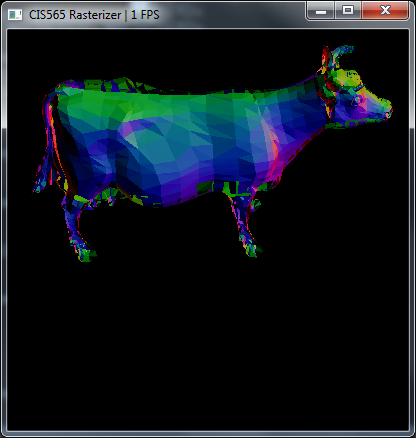  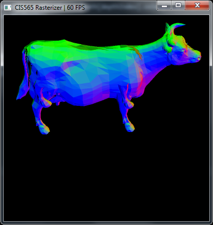

* Fragment shading
 * In the fragment shader, I applied a diffuse shader to the model.  There was a light source that was placed behind the camera.  Using the lights position, an ambient and diffuse term (created from the dot product of the surface normal and light vector), the new color of the surface was calculated.  The output of the fragment shader was a new triangle with the final output color.  The image below is the same cow image with the shader applied to it.

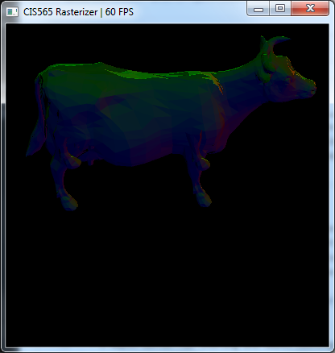

* A depth buffer for storing and depth testing fragments / Fragment to depth buffer writing (**with** atomics for race avoidance)
 * The depth buffer is part of the Fragment struct that is created during rasterization.  There are two values, a float depth and an int depth value.  This is because the AtomicMin function only allows for ints.  Thus, in order to compare the fragment depth's, avoiding race conditions, the floats must be turned into ints.  The value INT_MAX was used to do this.  This allowed me to convert the floats into ints with the highest possible accuracy.  The depth values were stored, and if two triangles were in the same fragment, the one with the smallest depth would be drawn.  When the fragments were passed into the fragment shader, the depth value was checked before applying any color to the fragment.  If the depth value was still equal to INT_MAX, that meant no triangle was in the fragment, and no color would be applied.  However, if the depth was less than that, it would draw the triangle that was in the fragment.  
 
* (Fragment shader) simple lighting scheme, such as Lambert or Blinn-Phong
 * A Phong shader was applied to the models.  The phong shader takes into account ambient, diffuse, and specular shading.  In this shader, the ambient term is .2, while the diffuse and specular term are determined by the lighting location and normal of the surface.  The image below shows the phong lighting with a red light.  

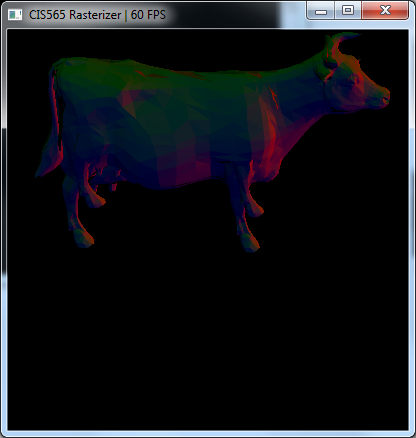

* Backface culling, optimized using stream compaction (thrust)
 * Backface culling checks whether a triangle is facing the camera.  If it is not facing the camera, then it is ignored, and not drawn by the fragment shader.  In order to determine whether a triangle was facing the camera or not, I used the signed area test.  The signed area test tells me whether the triangle's vertices are in clockwise or counter-clockwise order.  If they are in counter-clockwise order, then the triangle is backfacing and should be ignored.  This allowed me to mark each triangle as forward facing or back facing.  Then, I used thrust to stream compact the array of triangles, getting rid of any that had been marked as back facing triangles.  This allowed the rasterization step to take less time, as less triangles are being drawn.  
 * The image below shows an image of the cow with correct backface culling (the previous cow images have incorrect backface culling)
 * The graph below shows the speed up times for the amount of triangles that got deleted.  While, the backface culling does always give a speed up, the amount of speed up varies greatly between models.  I believe that the amount of speed up that occured, relied greatly on the size of the triangles.  The bigger the triangles were, the more of a speed up occured.  The flower was scaled larger, and hence had a larger speed up.

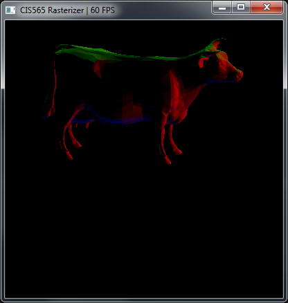

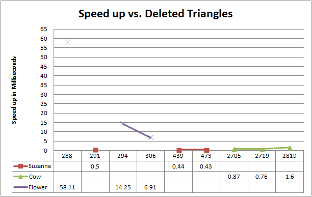

* Rasterize lines or line strips
 * In order to rasterize lines, we start with the two end points of the line.  We want to determine whether we need to walk through the x or y coordinates.  This is determined by looking at the values of (p1.x - p0.x) and (p1.y - p0.y).  Whichever has the largest absolute value, is the coordinate that we will step through.  Once we know this, we calculate the closest integer value that coresponds to the new x/y value.  This will tell us which new fragment needs to be colored.  We do this for every x/y value between p0.x/p0.y and p1.x/p1.y.  There are some other parameters that need to be checked, such as whether p0.x > p1.x, in which case we would want to be decreasing each new x value we use rather than increasing it.  Also, if the slope is equal to zero, then we know it will be a straight line, and do not need to do a new calculation for each step.  This added another kernel function. In my implementation, I drew three lines for each triangle.  It did not have enough of an impact on the rasterizer to cause any slow down that showed during the implementation.  When I used cuda event timers, on average this extra function took about .230 milliseconds.  It definitely helps that it is on the GPU and not CPU.  The GPU allows the lines for each triangle to be drawn at the same time, since each triangle is on it's own thread.  This implementation would have been a for loop that took a long time on the CPU.  
 * In order to show this, when running the program, press 'l' on the keyboard. This will turn on/off the lines.  The image below shows suzanne with and without the lines.
 
 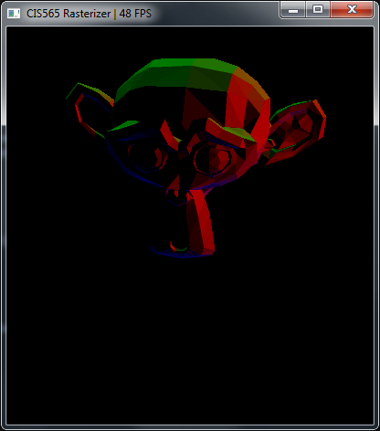 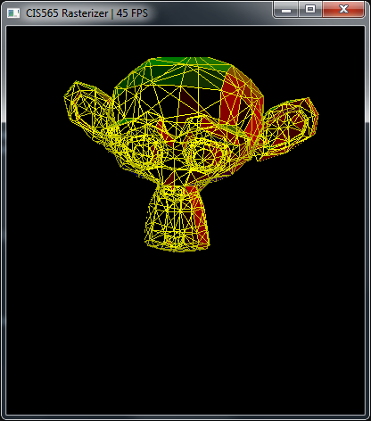
 
* Rasterize points
 * In order to rasterize points, I found the center of each triangle by averaging the x and y values of the three vertices.  Then, after transforming the points into screen coordinates, I colored that fragment black.  This implementation also did not add enough time to cause any slow down to be seen during the implementation.  On average, this implementation took about .090 milliseconds. Implementing this on the GPU also saved much time, compared to a CPU implementation.  Again, this is because each triangle's center was able to be calculated simultaneously on different threads.  The CPU implementation would have required a for loop that went through each triangle and would have added much more time to the implementation.
 * The image below shows the cow with the point rasterizing running.  In order to run the point rasterizer, press 'p' on the keyboard to turn it on/off.  
 
 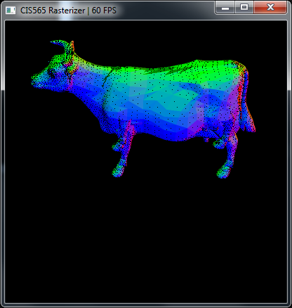

* Anti-aliasing
 * Anti-aliasing was done within the rasterization step.  In the rasterize, there was a thread for each triangle.  Then each thread looped through all fragments to determine if the fragment was in the triangle.  In order to add anti-aliasing, I added a for loop so that each fragment was looped through 4 times.  I uniformly chose the sampled points within each fragment.  When it was not done uniformly, there were artifacts around the edges of all triangles.  After this was done, there were four different colors for each fragment.  In the fragment shader, these four colors were averaged together to get the final color.  This implementation required more memory and a longer rasterization step for each triangle.  It may have increased the running time slightly, but not enough to cause any noticable change.  The GPU implementation of this is much faster than the CPU implementation.  Adding an extra for loop to the CPU implementation slows it down greatly, becuase all other loops are put on hold.  The GPU implementation does not have this issue, so while each thread may take a little longer, they are still occurring at the same time, and therefore, this implementation does not cause such a dramatic slow down.  
 * The below images show the difference between non-uniform anti-aliasing and uniform anti-aliasing.

 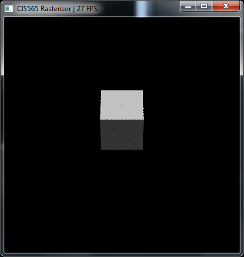 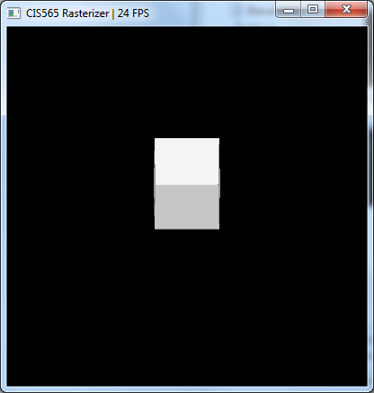 

* **Mouse**-based interactive camera support
 * The mouse-based interactive movements allow the user to change the rotation and scale of the model. By right clicking on the image, if you drag the mouse right or left, it will rotate the model corespondingly arond the y axis.  If you drag the mouse up or down, it will rotate the model corespondingly around the x axis.  Also, if you scroll on the image, it will scale the model up or down.  This implementation changes the model matrix in the rasterize function done on the CPU.  It does not impact the speed of the rasterizer, as it is just changing an input value.  

**IMPORTANT:**
For each extra feature, please provide the following brief analysis:

* Concise overview write-up of the feature.
* Performance impact of adding the feature (slower or faster).
* If you did something to accelerate the feature, what did you do and why?
* How might this feature be optimized beyond your current implementation?

### Performance Analysis

* For the cube, cow, suzanne, and flower model, I calculated how much time was spent in each step of the rasterizer.  This information is shown in the graphs below.  It is easy to see the rasterizer takes up the most amount of time in all the models.  This makes sense, as it loops through every fragment for each triangle.  Also, with the antialiasing, the number of fragment colors it is calculating is actually multiplied by four.  Also, the atomicMin function is in this step.  This will cause it to go slightly slower, as no two threads can access the same memory at once.  Thus, some threads will have to wait before they can pass the atomicMin step.  The backface culling was able to decrease the amount of time spent in this step, but it is still easily the most expensive step.  Also, the bounding box method was used for each triangle so that not all fragments had to be checked for each triangle.  Without this check, the rasterization step would take up an even larger portion of the running time.  

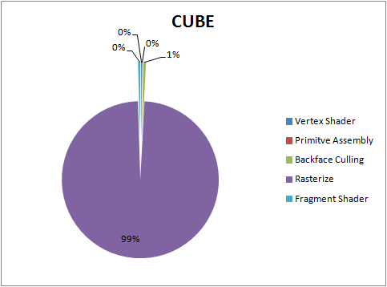

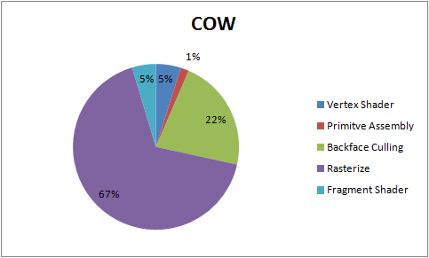

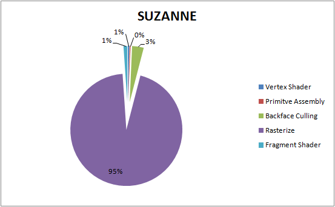

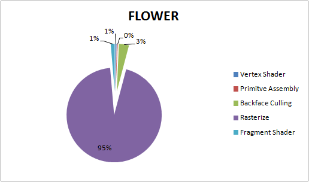

## Submit

If you have modified any of the `CMakeLists.txt` files at all (aside from the
list of `SOURCE_FILES`), you must test that your project can build in Moore
100B/C. Beware of any build issues discussed on the Google Group.

1. Open a GitHub pull request so that we can see that you have finished.
   The title should be "Submission: YOUR NAME".
   * **ADDITIONALLY:**
     In the body of the pull request, include a link to your repository.
2. Send an email to the TA (gmail: kainino1+cis565@) with:
   * **Subject**: in the form of `[CIS565] Project N: PENNKEY`.
   * Direct link to your pull request on GitHub.
   * Estimate the amount of time you spent on the project.
   * If there were any outstanding problems, or if you did any extra
     work, *briefly* explain.
   * Feedback on the project itself, if any.
