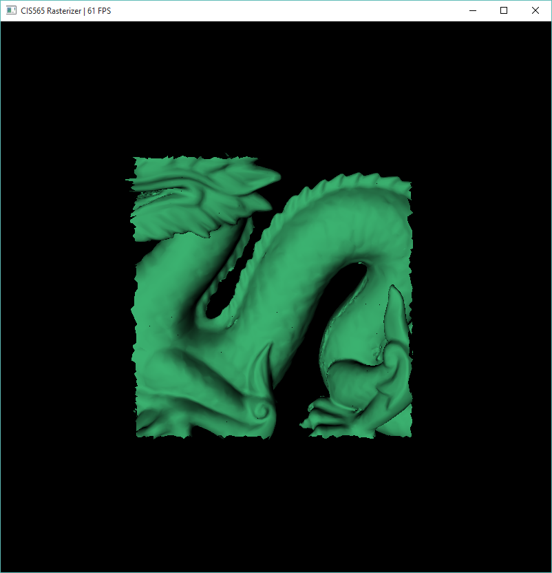

CUDA Rasterizer
===============

**University of Pennsylvania, CIS 565: GPU Programming and Architecture, Project 4**

* Bradley Crusco
* Tested on: Windows 10, i7-3770K @ 3.50GHz 16GB, 2 x GTX 980 4096MB (Personal Computer)

## Description

An interactive GPU accelerated rasterizer. The program uses the scanline rasterization technique and can render obj models using triangle, line, or point primitives. Additional features include interactive mouse controls, backface culling, scissor test culling, and color and normal interpolation to support smooth models.

### Stanford Dragon

### Video Demo
<ahref="https://youtu.be/Ul5QEM-jp3E" target="_blank"></a>

## Pipeline

### Vertex Shading

For vertex shading we take input vertices from a vertex in buffer and transform them by applying the model-view projection matrix so they are orientated correctly within our scene. After being transformed they are sent to a vertex out buffer.

### Primitive Assembly

While this project supports the rendering of different primitive types (triangles, points, and lines, see below for details), that is achieved through manipulating the only true primitive supported, triangles. The vertices that were transformed in the previous stage and sent to the vertex out buffer are turned into triangle primitives in groups of three, each making up one vertex of the triangle. The total size of the primitives array we create will be a third the size of the vertex out buffer.

### Backface Culling (Optional)

* **Overview**: Backface culling is a relatively simple procedure added to the pipeline as an option after the primitive assembly step. The step determines which primitives are facing the camera, and marks those that are not as not visible. After this has been done for all primitives, stream compaction is run on the resulting array of primitives and those that are not visible are removed from the pipeline. To determine if a primitive is facing the camera, we use the dot product between the vector from the camera to the model's position and the normal of the primitive.
* **Performance Impact**: Refer to the two below charts for visuals of the performance impact. Unfortunately by looking at the frame rate data we see that the feature is actually reducing general performance quite substantially. Without culling we see a frame rate of 109 fps. With scissor test enabled it drops to 87 fps. The next chart illustrates what is going on. We are actually getting the performance increase we'd expect with scissor test enabled. When we look at execution time for the rasterization step, which follows culling, it drops from 7,436 µs to 4,631 µs. So what's going on? The overhead of my stream compaction that takes place after culling to remove culled fragments is slowing down the program and erasing any performance gains we receive from the culling optimization.   

### Scissor Test (Optional)

* **Overview**: The scissor test is another relatively simple stage added as an option to the pipeline. In the scene in the program, a rectangular portion of the screen can be defined as the bounds of this scissor clipping. Anything outside the bounds will be clipped from the scene. Whether a primitive is to be displayed is determined by checking the maximum and minimum points on the primitive's bounding box and comparing those positions to the dimensions of the rectangle defining our culling area. If the max or min of the bounding box lays outside this area, the primitive is marked as not visible. Once we've run the test on all the primitives in the scene, stream compaction is used to remove the invalid primitives from the array.
* **Performance Impact**: Refer to the two below charts for visuals of the performance impact. Unfortunately by looking at the frame rate data we see that the feature is actually reducing general performance quite substantially. Without scissor test we see a frame rate of 109 fps. With scissor test enabled it drops to 79 fps. The next chart illustrates what is going on. We are actually getting the performance increase we'd expect with scissor test enabled. When we look at execution time for the rasterization step, which follows the scissor test, it drops from 7,436 µs to 5,315 µs. So what's going on? The overhead of my stream compaction that takes place after the scissor test to remove culled fragments is slowing down the program and erasing any performance gains we receive from the scissor test optimization.   

### Rasterization

#### Triangles
")

To render the basic rasterization primitive, the triangle, each GPU thread is responsible for one triangle. The bounding box for that triangle is retrieved, and, through the scanline implementation, the thread loops over each pixel in the bounding box.

#### Normal and Color Interpolation

* **Overview**: Implementing normal and color interpolation gives significantly more visually pleasing results, as can be seen above. Without the interpolation, models look obviously constructed of triangles. With interpolation, the models are smooth and provide the realistic effect we'd expect. To achieve these smooth models, the obj file must provide vertex normals. If not, the result will look like interpolation is disabled. The same for color, if not provided in the object file per vertex, the model will be one solid color. To calculate the interpolated results, we first calculate the barycentric coordinate. Once we do that and have determined that the coordinate is in bounds and the z position of our primitive passes the depth test, we interpolate by adding the sum of the product of the x, y, and z components of the barycentric coordinate and each of the three vertices, respectively.
* **Performance Impact**: Minimal. The majority of the performance overhead for this is in the calculation of the barycentric coordinate and the depth test, components that are required for the rasterization of the triangle primitive with or without interpolated normals and colors. The few multiplications and additions needed to calculate the interpolated values do not include noticible performance impact.

#### Points

* **Overview**: For this effect, the standard rasterization step of the pipeline is replaced with one to output points. Because we are only rendering a point and not an entire triangle, barycentric coordinates do not need to be calculated, nor do we have to interpolate the normals or colors across each vertex. Instead we just output the values for a single vertex to the depth buffer (I use the middle vertex at index one) and lead the others as zero. This vertex will be the point that is rendered to the screen.
* **Performance Impact**: There is actually a small increase in performance compared to the other two primitive types, as the point requires no additional calculation to be rendered, unlike the triangles and lines.

#### Lines

* **Overview**: The implementation for lines is more complicated than the other two primitives. For ease of implementation, I render the line between the first and second vertices of a the triangle primitives. There are two situations that need to be handled when rendering these. The first is the simplest case, when the line to render is a straight vertical line. Here we loop between the min and end values in the y direction and render as we travel along. For all other lines we must calculate a Bresenham line, is a method of approximating the rasterization of a line. Otherwise it works just like rendering the vertical line, with the main difference being a loop along the x direction while using the slope of the line to calculate a y value in the correct position at each iteration of the loop, and z is determined using the depth test.
* **Performance Impact**: Minimal. Having to loop through and generate the line and do the Bresenham calculating requires extra computation, but is similar in execution time to the triangle primitive implementation.

### Fragment Shading

The fragment shader updates the color value of a fragment in the depth buffer using a basic Lambert shader. It essentially adds lighting to the scene. As of this writing the implementation uses a single light source at located at the camera position to keep the object lit while the user moves the camera using the mouse controls.

### Fragments to Framebuffer
These fragments are finally output to the framebuffer, and from there displayed to the screen.

## Additional Features

### Mouse Interaction

* **Overview**: The rasterizer renders in real time and can be interacted with by the user using mouse controls.
* **Rotation**: Holding the left mouse button and moving the cursor rotates the camera around the object.
* **Panning**: Holding the middle mouse button and moving the cursor pans the camera along the x and y directions.
* **Zooming**: Moving the scroll wheel in and out moves the camera along the z axis.

## Performance Analysis

### Rasterization Pipeline Stage Durations for Select Models

Below you can see performance breakdowns for three different models, a smooth cow model, a smooth Stanford dragon model, and a complex "flower" model. The breakdown shows the percentage of team each main kernel stage of the rasterization pipeline takes relative to the others. In all three examples, you can see that by far the largest portion of the pipeline is the rasterization stage. Which stage comes in second varies dramatically. Between the cow and the dragon model, we see both the vertex shader and the primitive assembly stages increase, the primitive assembly especially so. This is because of the additional complexity of the dragon model, it contains many more polygons than the cow model. When we look at the chart for the "flower" model, the duration of the rasterization step is so significant that it essentially erases every other step in the pipeline. This model presents a very complicated depth problem for the depth test component of the rasterization stage, and the results here show how significant that portion of the pipeline is to performance.

### Optimizations
I was able to do a significant amount of optimization work on this project. Below is the original performance data from NSight.

You can see that there is occupancy issues with the vertexShading, assemblePrimitives, and rasterization kernels. Below is the updated NSight data after all of my optimizations.

Note: Ignore the kernel durations, as this data is for two different models. I accidentally took the wrong original data on too simple of a model. The model for the second data set is the much more complicated Smooth Stanford Dragon model.

* **vertexShading**
* Increased block size from 128 to 256 and based grid size off of number of vertices, not screen size. Dramatically reduced execution time of the kernel.
* Reduced register count to 30 per thread from 38, achieving 100% occupancy.
* **assemblePrimitives**
* Reduced register count to 18 from 48, achieving 100% occupancy.
* **rasterization**
* Reduced register count to 48 from 104, going from 25% occupancy to 62.50%.
