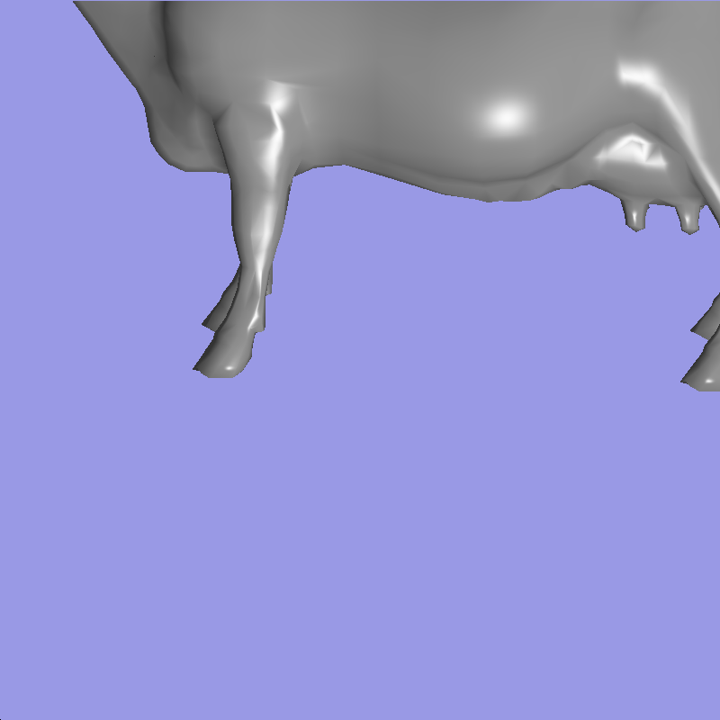
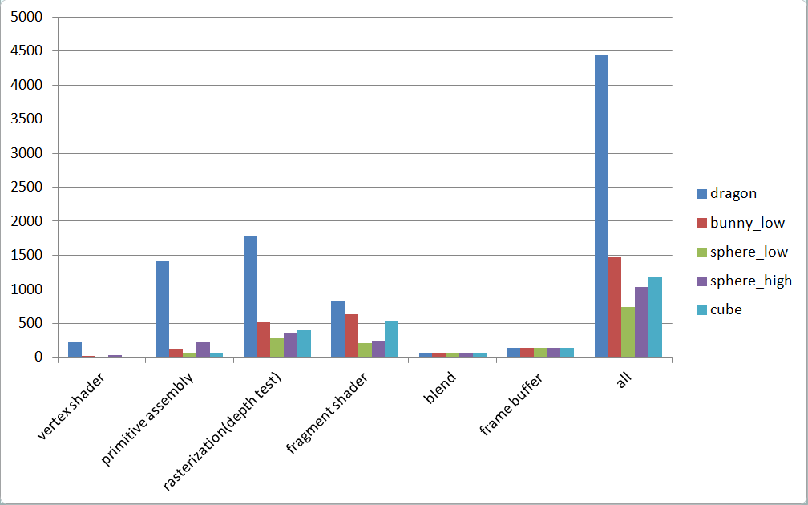

CUDA Rasterizer
===============

**University of Pennsylvania, CIS 565: GPU Programming and Architecture, Project 4**

University of Pennsylvania, CIS 565: GPU Programming and Architecture, Project 3

siqi Huang Tested on: Windows 7, Inter(R) Core(TM) i7-4870 HQ CPU@ 2.5GHz; GeForce GT 750M(GK107) (Personal Computer)

Representative Images:

Video Demos:

PART O: Program Control
use R to rotate;
use A,D and W,S to move the light source
use Up and Down arrow to adjust the distance to the object
use Enter to start record images
use Backspace to end record images
use mouse scroll to adjust fovy angle
use mouse move to move around the object.

PART I: Camera Setup(Vertex Shader)
For this project, there is not a very clear idea about the camera, but you still have to do model-view-projection transformation to get the basic vertex input. In this stage, I have used the interactive control from both keyboard and mouse input(see above). We first apply model rotation, then we apply the camera view, with the lookAt function in glm. Finally we do the perspective transformation from the world to the camera. In the process, I have left out the translation and scale of the object. For the translation, because we only have one object and I have to make sure the window alway show the object, so the translation maybe useless in that case. For the scale part, the up and down arrow control is an alternative.

PART II: Primitive Assembly and Rasterization
The primitive assembly is easy, just to put 3 vertex in a group. For the rasterization, the method used here is one thread per triangle. I used AABB to find the minimal area that a thread needs to scan. Then if the pixes actually fall into the triangle area, to begin with, I output all color white, which can only get a silhouette for now.

PART III: Depth Test
To ensure we get the correct intersection, we have to deal with race condition in GPU. When two triangle intersect in the view direction and two thread tries to deal with the pixes at the same time, race condition occurs. Here I used depth buffer and AtomicMin to solve the problem, which IN MOST CASE guarantee only one thread is changing the depth value at one time. After this is implemented, we can get the normal map of an object.

PART IV: Fragment Shader
To make our scene more interesting, we apply the color to our object. Using the lambert's law, we get the diffuse color of the object. To get the Blinn-Phong effect working, we first need to define a light source, and the position of it can be adjusted. After that, we get the Blinn-Phong result and here we combine the two color with some weight, say 0.4 and 0.4.(0.2 left for ambient color). So we get image like this.

PART V: Blending
This is not a necessary step, but using the fog effect here will make our scene more interesting. Before we output the depthBuffer color to ImageBuffer, we blend the color of our object with some "fog". The weight of the fog is decided by the distance of the intersection point(depth value) to the camera. If the depth value goes beyond a threshold, just only use the fog color.

PART VI: Anti-Aliasing
The anti-aliasing used here is a little different from what is used in path-tracing. Because we get one frame each time, there is no color accumulation. So we have to make sure all the we get the final color in just one iteration. Also we cannot use gittered position here, or the image will be unstable. Here I used a 0.25 offset for both x and y direction. After doing that, I get some wired vertical and horizontal lines. That is actually caused by the improper scan of a triangle. If we enlarge the scan area by 1/offset in both dimension and both direction, the problem is solved. Here are images of comparison.
Image without Anti-Aliasing:

Image with Anti-Aliasing:

The effect in the upper part of the image is very obvious. The bottom part is not that good, probably because I only used 4 "ray" in one iteration and the 4 rays all fall in the cow area but they are actually on the boundary. Since this method is very time-comsuming, a larget number of ray in one iteration is not implemented.

PART VII: Edge Cut Off
In the openGL window, we must make sure all coordinate value is in range -1 to 1. If not, we just discard that pixe. We cannot do this in the Vertex Shader because that may change the shape of the object. When we have to discard a pixe, we discard it instead of the whole triangle. There are comparison images:
Without cutting off:

With cutting off:

We can see in the first image, the tile part of the cow, which should disappear actually reappear in the left part. Also, after doing that, the problem will be mush faster(See Performance Analysis).

PART VIII: Texture Mapping
The sole color is boring, and the texture is more interesting that that. First I import a texture to GPU, then in the Fragment Shader process, if the object has texture coordinates, just apply the texture color to it. The texture color is actually calculated in the Fragment shader, if you precalculate that in the vertex shader, which is possible, you can only get the value before interpolation, which will make the image very blurry

texture with fog

PART IX: Performance Analysis
1 Render time in each step:
Here I divide the render process into six steps: vertex shader, primitive assembly, rasterization, fragment shader, blend, frame buffer.

The first image show the time percent used in each process across each objects. Image 2 show the actual time used for each of the process in every step in 100 frames. And image 3 show how many faces are there in each objects.
It is obvious that the size of the faces has direct impact on the time used in vertex shader. The time used in blend and frame buffer are almost the same in number. The percentage of rasterization in each object are very close, but the percentage of fragment shader differs much. For the dragon object, which is very large, its time is spent evenly on all steps, but each one takes more time than other object with their counterparts. One very interesting finding here is that the larger the triangle in one object is, the more time it takes to rasterize and fragment. The sphere_low has less number of triangles but large triangles. The cube has only 12 triangles, but each triangle is very large. We can see
