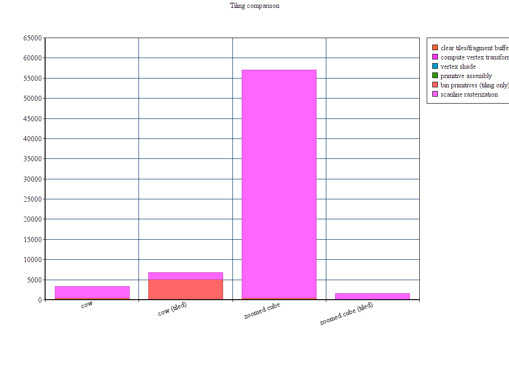

CUDA Rasterizer
===============

**University of Pennsylvania, CIS 565: GPU Programming and Architecture, Project 4**

* Kangning (Gary) Li
* Tested on: Windows 10, i7-4790 @ 3.6GHz 16GB, GTX 970 4096MB (Personal)

This repository contains a basic rasterization pipeline written in CUDA. This pipeline has the following rough stages, as seen in the rasterize() function in [rasterize.cu](src/rasterize.cu#L856):
* clear the fragment/depth buffer
* multiply all scenegraph transformation matrices by the view/projection matrix
* shade vertices
* perform primitive assembly
* use scanline rasterization to generate fragments. perform depth tests.
* shade the fragments
* copy the fragments to the frame buffer

This pipeline also supports instancing, anti-aliasing, and tile based rasterization. Enabling anti-aliasing and tile rasterization cause some notable changes to the pipeline, which will be explained below.

**Places to Tweak**
Most configurable settings are in [main.cpp](src/main.cpp), which handles sending delivering buffers of vertices, normals, indices, and matrices to the rasterizer. The [top](src/main.cpp#L16) of the file contains some variables that can be used to control the camera's starting state. Camera controls are spherical. The camera can also be controlled using the keyboard. The left, right, up and down arrow keys rotate the "sphere" of the camera, while the z and x keys control the "radius." Field of view can also be changed with f and g but may be unpredictable.
[Line 199](src/main.cpp#L199), if uncommented, activates tiled rendering.
[Line 202](src/main.cpp#L202) similarly toggles anti aliasing.
Adding modeling transformations to the [transformations vector](src/main.cpp#L181) allows adding additional instances. Lights are added through a series of buffers in the same function.
Changing [src/rasterize.cpp#L912] from MSAA to FSAA will switch between multisample and full screen antialiasing.

**Instancing**

Instancing allows "drawing" one model (one set of vertices, indices, and normals - this rasterizer only supports rendering one model at a time) multiple times in a scene with different transformations. This rasterizer implements instancing by keeping a larger buffer for primitives and transformed vertices. It also adds a pipeline stage in which model matrices (translation * rotation * scale) are multiplied by the camera's view/projection matrix.

The point of instancing isn't to increase performance on the GPU (the GPU is still drawing all the triangles) but to decrease the bandwidth consumption when preparing a scene by reducing the amount of data that needs to be sent from the host to the device. This improvement is demonstrated by the following charts:

In this comparison, 6 cows were rasterized by uploading an obj file with 6 cows in it (see [objs/many_cows.obj](many_cows.obj)) and separately by uploading data for a single cow and transformations for 6. Although the relevant pipeline section runtimes were about the same for both cases, the host-to-device transfer time differs dramatically.

**Anti Aliasing**

This rasterizer implements two forms of antialiasing: Full Screen Antialiasing (FSAA) and Multi Sample Antialiasing (MSAA). Full Screen Antialiasing is closest to the original concept of antialiasing: multisample each pixel to produce a smooth result. In this pipeline, enabling antialiasing replaces the standard scanline rasterization and depth test stage with one that takes 5 samples per fragment distributed across the fragment's screen coordinate area, which results in additional computation time. Where FSAA and MSAA differ is in fragment shading: FSAA shades each of the 5 samples independently, while MSAA only shades each sample that strikes a unique primitive. The result, as demonstrated below, is that the MSAA pipeline spends less time in fragment shading, which would produce more dramatic performance gains over FSAA with a highly complex fragment shader:

Although MSAA is an approximation of FSAA, the results are visibily similar. This is because aliasing is mostly noticed on the edgs of primitives, so MSAA "cheats" in fragment shading by treating samples from one fragment striking "inside" primitives similarly to single-sampled fragments. The FSAA image is in the middle and the MSAA image is to the far right.

**Tiling**

Tiling is a rendering technique used to reduce global memory access in the scanline rasterization/depth test stage and is commonly used on mobile GPUs to reduce power.

Standard scanline rasterization is parallelized per primitive. An Axis-Aligned Bounding Box is built around the primitive, which corresponds with the screen pixels that the primitive covers. Points on the primitive are then sampled using this bounding box as a grid, scanning fragments line by line and testing them against a depth/fragment buffer that all the primitive processing kernels can access.

What happens if two primitives that would overlap in the current view are being rasterized simultaneously by separate kernels? It is very likely that at some point they will access the same fragment in the depth/fragment buffer. This implmentation uses CUDA's atomicMin to resolve this race condition and maintains a parallel buffer of integer depths to the fragment buffer.

These integer depth and fragment buffers exist in global memory, which is slow and power inefficient to access. Tiling dices the screen space into a grid of "tiles," each of which has its own depth and fragment buffer in block shared memory, as well as a list of primitives that overlap this tile in screen space. This implementation thus parallelizes scanline rasterization over tiles, with each tile checking the fragments it covers serially.

Unfortunately, this implementation of tiling is a little messy and incomplete. Fortunately, enough of the output image is correct to provide an analysis and demonstrate a use case in which it is far mroe efficient than full screen rasterization.

*Pipeline Changes*
The Tiling pipeline diverges completely after primitive assembly. This implementation also ditches the depth buffer clearing stage in favor of a tile clearing stage, as each tile gets its own depth and fragment buffer.
The tiling pipeline looks something like this:

* multiply all scenegraph transformation matrices by the view/projection matrix [unchanged]
* shade vertices [unchanged]
* perform primitive assembly [unchanged]
* for each tile in parallel, generate a list of primitives that are likely to be in this tile.
* for each tile in parallel, use scanline rasterization to generate fragments. perform depth tests.
* shade the fragments [unchanged]
* copy the fragments to the frame buffer [unchanged]

Tiling requires additional buffers to be added in global memory. This implementation uses a buffer of "tile" structs and a concatenated list of the primitive indices that each tile contains.

*Things to look at*
The [tileScanline](src/rasterize.cpp#L661) kernel sets its local fragment and depth buffers at the start of the kernel. This is also where debugging can be toggled. The kernel supports drawing a checkered background to indicate the tile boundaries (Tile size is 16 x 16, set by TILESIZE) and drawing a red background for tiles whose primitive lists are nonempty.

*Performance*
The performance gains differ based on the scene case. In the case of a scene with many primitives in view (the cow), with each primitive relatively small, standard rasterization outperforms tiling.

However, in the case of a scene with few primitives in view that are very very large (the cube), tiling dramaticaly undercuts traditional rasterization. This is because the serial scanline process in for tile is capped by the tile size, while in traditional rasterization the scanline process for each primitive is capped by the total render resolution. Thus, "dicing" large primitives into smaller scanline regions (the tiles) better exploits parallelism.

