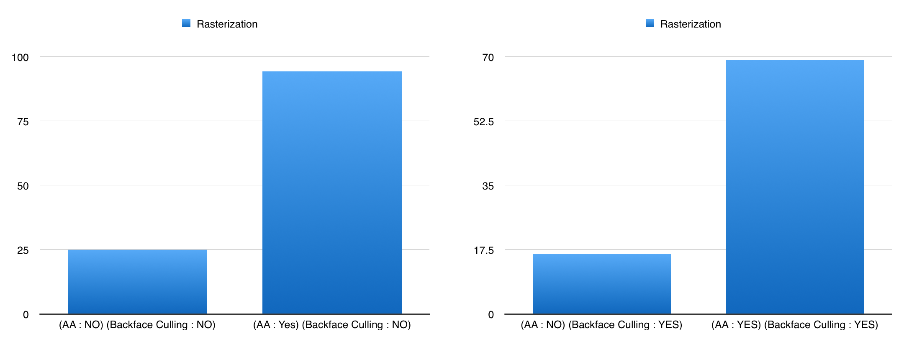
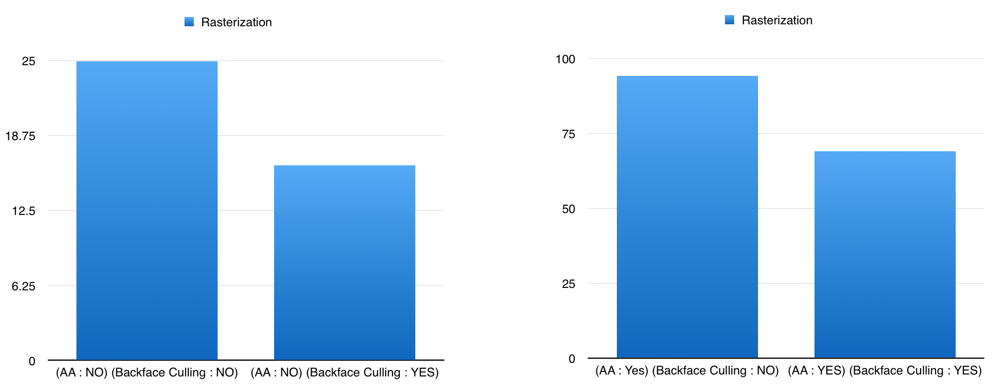

CUDA Rasterizer
===============

**University of Pennsylvania, CIS 565: GPU Programming and Architecture, Project 4**

* SANCHIT GARG
* Tested on: Mac OSX 10.10.4, i7 @ 2.4 GHz, GT 650M 1GB (Personal Computer)

### What is a Rasterization Pipeline

A rasterization pipeline (also known as the Graphics pipeline or the Rendering Pipeline) is a sequence of steps used to create a 2D image from a 3D scene. The basic steps in a very simple rasterization pipeline include :

1. Vertex Shading
2. Primitive Assembly
3. Rasterization
4. Fragment Shading

### GPU Based Interactive Rasterization Pipeline

Building up on the idea of the graphics pipeline, I implemented the a GPU based Rasterization pipeline in CUDA and C++. The project implements the above mentioned steps with features like depth testing, backface culling, anti aliasing, point rasterization and line rasterization.

#### Controls

This is an interactive application. The controls are as follows:

* `Mouse Left Button` : Click and Drag the rotate
* `Mouse Middle Button` : Click and Drag the pan
* `Mouse Right Button` : Click and Drag horizontally to Zoom
* `F` : Reset Camera
* `A` : Toggle Anti Aliasing
* `B` : Toggle Back Face Culling
* `M` : Toggle Rasterization Mode (Triangles, Points, Lines)
* `Space Bar` : Save Image to file
* `ESC` : Exit

## Features

In this project, I implemented the following features

* Vertex Shading
* Primitive Assembly for Triangles, Points and Lines
* Back Face Culling
* Rasterization of the above primitives
* Scissor Test
* Depth Testing
* Anti Aliasing
* Fragment Shading with color and normal interpolation
* Interactive Mouse Model

### Implementation Details

##### Vertex Shading
In this step, the main task is to take the primitives from the world coordinate space to the screen space. This requires transforming the vertices with the model, view and projection matrices. Once the vertex is multiplied by the matrix, it gives us the Normalised device coordinates. They are then mapped to the screen coordinates.

##### Primitive Assembly
The next step in the pipeline is Primitive assembly. Based on the rasterization mode, we store the vertices in the form of triangles or lines. In the case of point rasterization, this step can be skipped as we already have our primitve. These primitives are passed to the rasterization step. 

##### Back Face Culling
Back face culling is a step to remove the trianges that area facing away from the camera. These triangles cannot be seen the camera as the normal would be facing away. To find them, I used the dot product of the camera direction and the triangle normal which is just the average of the vertex normals. If the dot product is greater than 0, then the triangle is facing away from the camera. This triangle is marked for deletion.
Then I use stream compaction to remove these triangles (`thrust::remove_if` used). This gives a huge performance gain as explained below.

##### Raterization
Once the primitives are assembled, we send them to the rasterizer. This is a step to determine which fragments will be shaded.

* <b>Rasterizing Triangles</b>

	For triangles, I find the bounding box of the traingles and loop over the corresponding fragments. The fragments that fall in the triangle are considered for scissor and depth test.

	* <b>Scissor Test</b>
	
		This is a fairly straight forward test. We define a rectangular area on the screen. Any fragment outside this area is not considered. Fragments within the area are considered for fragment shading. I use the screen boundaries as my scissors, this cuts the image at the boundaries else they would wrap around the other side.
		
	* <b>Depth Test</b>
	
		The same fragment can be shared by more than one triangle. In such case, we need to decide which triangle nearer to the camera. This is called depth testing. The triangle that is closer to the camera is considered, and the fragment stores the color and normal based on that triangle. Comparison of the result with and without depth test is as follows
		
		 
		
	Once we decide which fragment is to be considered and the corresponding triangle, we interpolate the color and normals to get a smooth shaded effect. Barycentric interpolation is used for this. Comparison between smooth shaded and flat shaded images.
	
	 
* <b>Rasterizing Lines</b>

	For lines, I use the naive line rasterization method. Based on the slope of the line, I move either in the x or the y axis from one point to the other. At every scanline, I find the point that would fall most closely on the line and use it to mark the fragment.
	When the slope of the line is less than 1, we increment in the x axis and solve for y, while for a slope >1 vice versa. The equation `y = mx + c` is used to solve for the point.
	
	

	
* <b>Rasterizing Points</b>

	For points, nothing extra is required. The point itself us used to find the fragment that it will correspond to and that fragment is marked for coloring.
	
	

	
##### Anti Aliasing
To remove aliasing, I super sample the image and then average the color in the fragment shader. 4 samples are taken per fragment. As expected, this slowes down the performance as we have to perform both the fragment and color calculation 4 times.
Comparison between aliased (left) and an anti aliased (right) image is as follows. As we only over sample by 4 pixels, the image is still a little aliased

 

##### Fragment Shading
I used simple lamberts law to calculate the color of the fragment. Using the interpolated normal and color value of the fragment, I calculate the light intensity of the fragment and save the color.

After all these steps, the final step is to send the fragment colors to the fragment buffer that is then rendered on the screen.

### Performance Analysis

The image used for rasterization analysis is as follows :

The following table shows the time in ms taken by the 4 basic steps of the pipeline and impact of Anti Aliasing (AA) and Back Face Culling. NOTE: Others include the time for steps like back face culling or function calls etc.

Both anti aliasing and back face culling have no impact on vertex shading. This is they have no role to play in this step. In primitive assembly, back face culling speeds up the process. This leads to lesser triangles for rasterization which makes it faster.

The corresponding bar stack and the pie for the various steps is as follows. We can see that in every case, the maximum time is taken by the rasterization step.

In all the cases the maximum time is taken by the rasterization step and the next most time consuming step is the fragment shader. These are the 2 most computationally expensive steps and this is an expected result.

Let us look at the impact of Anti Aliasing and Back Face Culling on our performance more closely. 

###### <u>Anti Aliasing Performance Impact on Rasterization</u>

As I used super sampling, for anti aliasing, the performance was expected to slow down. This is because we are doind 4 times more work for rasterising. Both in the case of Back face culling off (left) and on (right), the performance for rasterization is almost 4 times slower.

###### <u>Back Face Culling Performance Impact on Rasterization</u>

Back face culling removes a decent number of triangles from the scene (from around 5800 to 2900 for cow). This makes the rasterization step faster as there are less triangles to run through. This can be seen in the bar graph. The speed up achieved is approx 1.5x.

