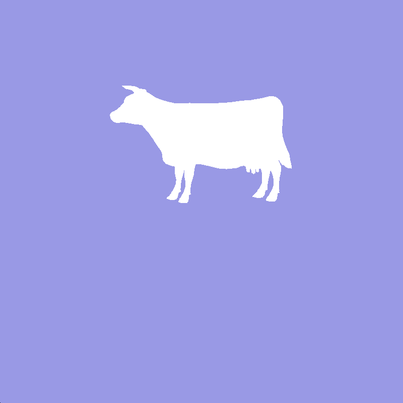

CUDA Rasterizer
===============

**University of Pennsylvania, CIS 565: GPU Programming and Architecture, Project 4**

University of Pennsylvania, CIS 565: GPU Programming and Architecture, Project 3

siqi Huang Tested on: Windows 7, Inter(R) Core(TM) i7-4870 HQ CPU@ 2.5GHz; GeForce GT 750M(GK107) (Personal Computer)

Representative Images:

Video Demos:

PART O: Program Control
use R to rotate;
use A,D and W,S to move the light source
use Up and Down arrow to adjust the distance to the object
use Enter to start record images
use Backspace to end record images
use mouse scroll to adjust fovy angle
use mouse move to move around the object.

PART I: Camera Setup(Vertex Shader)
For this project, there is not a very clear idea about the camera, but you still have to do model-view-projection transformation to get the basic vertex input. In this stage, I have used the interactive control from both keyboard and mouse input(see above). We first apply model rotation, then we apply the camera view, with the lookAt function in glm. Finally we do the perspective transformation from the world to the camera. In the process, I have left out the translation and scale of the object. For the translation, because we only have one object and I have to make sure the window alway show the object, so the translation maybe useless in that case. For the scale part, the up and down arrow control is an alternative.

PART II: Primitive Assembly and Rasterization
The primitive assembly is easy, just to put 3 vertex in a group. For the rasterization, the method used here is one thread per triangle. I used AABB to find the minimal area that a thread needs to scan. Then if the pixes actually fall into the triangle area, to begin with, I output all color white, which can only get a silhouette for now.

PART III: Depth Test
To ensure we get the correct intersection, we have to deal with race condition in GPU. When two triangle intersect in the view direction and two thread tries to deal with the pixes at the same time, race condition occurs. Here I used depth buffer and AtomicMin to solve the problem, which IN MOST CASE guarantee only one thread is changing the depth value at one time. After this is implemented, we can get the normal map of an object.

PART IV: Fragment Shader
To make our scene more interesting, we apply the color to our object. Using the lambert's law, we get the diffuse color of the object. To get the Blinn-Phong effect working, we first need to define a light source, and the position of it can be adjusted. After that, we get the Blinn-Phong result and here we combine the two color with some weight, say 0.4 and 0.4.(0.2 left for ambient color). So we get image like this.

PART V: Blending
This is not a necessary step, but using the fog effect here will make our scene more interesting. Before we output the depthBuffer color to ImageBuffer, we blend the color of our object with some "fog". The weight of the fog is decided by the distance of the intersection point(depth value) to the camera. If the depth value goes beyond a threshold, just only use the fog color.

