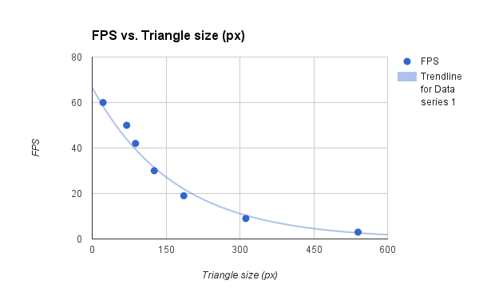

CUDA Rasterizer
===============

**University of Pennsylvania, CIS 565: GPU Programming and Architecture, Project 4**

* Levi Cai
* Tested on: Windows 8, i7-5500U @ 2.4GHz, 12GB, NVidia GeForce 940M 2GB

Attack of the cowwwssss!

### Graphics Pipeline

This is an implementation of a CUDA-based graphics pipeline with the following stages/features:

* Vertex shading (Apply transformations to vertices)
* Instancing (Create multiple sets of vertices according to new transformations)
* Primitive Assembly (Assemble vertices into triangles/primitives)
* Rasterization with Anti-Aliasing (FSAA using fixed-pattern supersampling) (Convert triangles to fragments)
* Fragment shading (Determine lighting for fragments)
* Fragment to Frame buffer transfer (Fragments into pixels, AA as needed)
* Mouse control
* Color interpolation on primitive surfaces

### Feature Demos

## Short film demonstrating mouse control

https://www.youtube.com/watch?v=1zS9fQGLfO8

## Proper normals

Simple illustration of proper handling of normals during Model-world transformations.

## Half-done Geometry Shader

This was an initial attempt at a Geometry Shader stage for the pipeline. The input was
triangle vertices, and for each vertex, output an additional triangle (1 prim -> 3 prim).
However, I was unable to finish with this stage due to time contraints.

## Depth-Testing

Simple illustration of a properly depth-tested image (without race conditions) and what happens when the
depth test has been reversed (the incorrect image).

Correct:

Incorrect:

## Color Interpolation

Each vertex of each primitive was set to a different color to illustrate proper interpolation of colors, normals can be visualized in a similar manner. These were computed in the rasterization step by using the barycentric coordinate of each fragment as the weight of the color of each associated vertex, which were then summed together to get the fragment color.

## Instancing

Instancing was done in the vertex shading stage. This required generating multiple sets of model-view-perspective transformations (one for each instance) and then generating separate sets of vertices from the original vertices according to their respective transformations. 1 thread per in-vertex was used and for-looped among the model-view-perspective transformations in order to create multiple sets of vertices, as well as duplicating the indices so that vertices could be properly assembled into primitives. An optimization may be to use 1 thread per out-vertex instead.

5x cows with translation and rotations.

## Anti-Aliasing

Anti-Aliasing was accomplished by super sampling each pixel according to a fixed grid pattern that is variable-adjustable. This is accomplished in the rasterization portion of the pipeline. The fragments are then combined into single pixels via averaging in the Fragment to Buffer stage of the pipeline.

3x super sampling results.

### Performance Analysis

##Comparison of size of triangles vs. FPS

This comparison illustrates the bottleneck of the rasterization portion of the pipeline.
As triangles get nearer to the camera (effectively, larger), then each thread must spend 
more time rasterizing. One possible method of reducing this is to compare the number of
primitives to be rasterized vs. the size of the primitives on screen. If the ratio of size to 
number is large, then instead of launching 1 thread per primitive, then launch one thread per
fragment and depth test sequentially that way.

##Comparison of pipeline stages

##Performance Effects of super-sampled Anti-Aliasing

It is quite clear that AAing in this manner is extremely costly as the samples per pixels increases.

