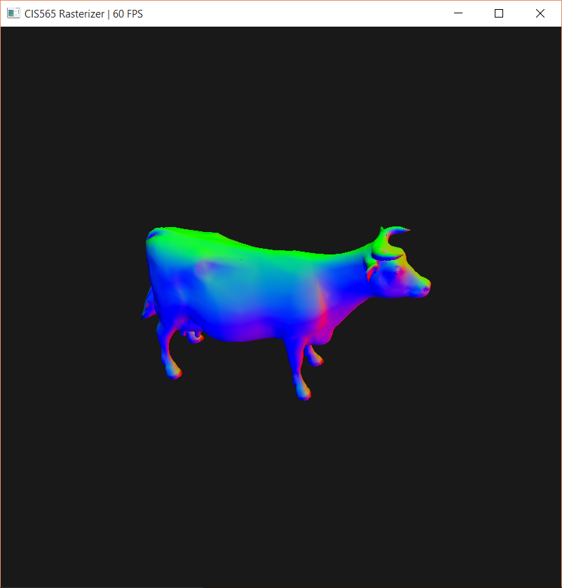

CUDA Rasterizer
===============

**University of Pennsylvania, CIS 565: GPU Programming and Architecture, Project 4**

* Ziwei Zong
* Tested on: Windows 10, i7-5500 @ 2.40GHz 8GB, GTX 950M (Personal)

Overview
========================

[Demo Pic]
[Demo Video]

Description here:...

#### Controls

|  KEY/Mouse	|   Function						| Demo Image		|
|---------------|-----------------------------------|-------------------|
|Left Mouse		| Rotate							|  [pic]			|
|Middle Mouse	| Zoom								|  [pic]			|
|Right Mouse	| Move								|  [pic]			|
|Key '0'		| Wireframe only					|  [pic]			|
|Key '1'		|     Color							|  [pic]			|
|Key 'w'		| turn wireframe on/off				|  [pic]			|
|Key 't'		| turn texture on/off			    |  [pic]			|
|Key 'n'		|  normal testing					|  [pic]			|
|Key 'd'		| turn displacement mapping on/off  |  [pic]			|
|Key 'm'		|use middle point tessellation method|  [pic]			|
|Key 'c'		|use curved PN tessellation method	|  [pic]			|
|Key Up/Down	|increase/reduce tessellation level |  [pic]			|
|Key Left/Right	|increase/reduce texture repeat		|  [pic]			|

Features
========================

#### Tessellation

**Middle Point Tessellation**

|original geometry			|Middle Point Tessellation	| Curved PN Tessellation
|:-------------------------:|:-------------------------:|:-----------------------:
|		|	|	

**Smooth Tessellation (Curved PN Method)**

|original geometry			|after tessellated using cubic Bezier interpolation
|:-------------------------:|:-------------------:
|	|

#### Displacement Mapping

Tessellation level	|without displacement map	|with displacement map
:------------------:|:-------------------------:|:-------------------:
		5			|		|

Tessellation level	|after displacement map		|normal testing for displacement map
:------------------:|:-------------------------:|:-------------------:
		8			|		|

#### Texture Mapping

**Bilinear Texture Filtering:** 

without texture filtering	|with bilinear texture filtering
:--------------------------:|:-------------------------:
		|

**Texture Repeat:** 

        2.4     |        5.8     | 15.8
:--------------:|:--------------:|:--------------:
||

#### Interpolation

without normal&color interpolation	|with normal&color interpolation
:----------------------------------:|:-------------------------:
			|
			|

Performance Analysis
========================

#### Pipeline Optimization

Considering that after loading the geometry, there's no need to redo primitive assembly and tessellation within each frame when
 the tessellation level dosn't change. Therefore, I only do vertex shader and primitive assembly once and take them out of the main loop.
 Instead, all vertices' ndc value and window positions are updated based on current transformation matrices (view, projection, window...) in each frame.

 The pipeline workflow is shown below.

* **Analysis for Tessellation**

Tested suzzane.obj (968 faces, 2904 vertices) with only tessellation.

 | 

* **Analysis for Tessellation and Displacement Map**

Tested plane.obj (2 faces, 4 vertices) with tessellation,texture mapping and displacement mapping.

 | 

Both two cases above shows that the new pipeline out performs the previouse one when the tessellation level is high.

And another interesting thing is that when tessellation level is low, it actually goes faster by increasing the tessellation level for both two cases.
My guess is that when tessellation level goes a bit higher, there are more threads dealing with smaller AABBs. 
Thus the same amount of work is paralled as more smaller tasks. When the triangle counts is below certain amount, it trades off the increment of triangles and threads very well.

#### Obj Analysis

References
========================

**Mouse Control**

* http://www.opengl-tutorial.org/beginners-tutorials/tutorial-6-keyboard-and-mouse/
* http://r3dux.org/2011/05/simple-opengl-keyboard-and-mouse-fps-controls/
* https://github.com/LWJGL/lwjgl3-wiki/wiki/2.6.3-Input-handling-with-GLFW

**Tessellation**

**Texture Mapping**

* https://en.wikipedia.org/wiki/Bilinear_interpolation

**Displacement Map**

* https://www.opengl.org/wiki/Calculating_a_Surface_Normal

**Obj Files**
* http://www.kunzhou.net/tex-models.htm

To Do...
========================
1. cannot tessellate cow.obj
2. cannot open sponza.obj
3. Smooth Tessellation
4. seperate textuers